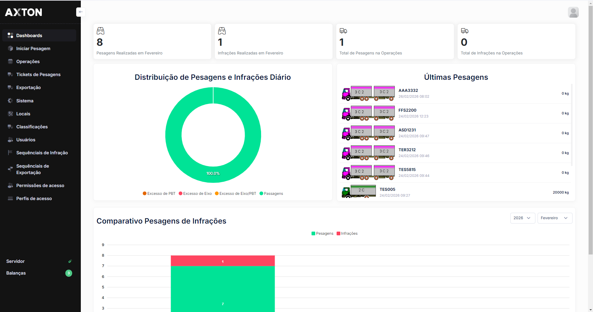
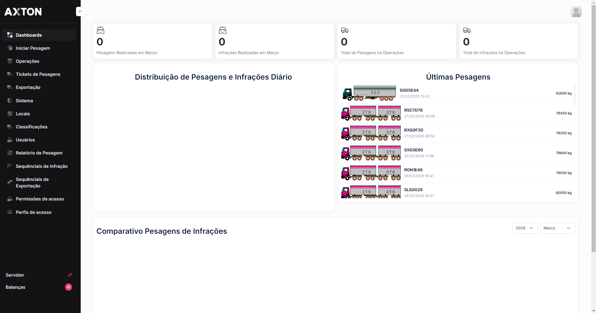

# Painel Principal (Dashboard)

O Painel Principal é a tela inicial do AxTon após a autenticação.

Apresenta uma visão completa do estado operacional do sistema, com gráficos, alertas em tempo real e rastreamento de notas fiscais.

## Como acessar

- Ao realizar o login, o sistema redireciona automaticamente para o Dashboard
- Para retornar a qualquer momento: clique no **logo AxTon** no topo esquerdo ou no primeiro ícone do menu lateral

---

## Painéis do Dashboard

O Dashboard é composto por **5 painéis principais**, cada um focado em um aspecto da operação:

### 1. Alertas por Tipo

| Item | Descrição |
|------|-----------|
| **Período** | Últimas 72 horas |
| **Visualização** | Gráfico de barras horizontal |
| **Dados** | Quantidade de alertas agrupados por tipo (ex: "Veículo sem MDF-e") |
| **Utilidade** | Identificar rapidamente os tipos de ocorrências mais frequentes |

### 2. Fluxo de Passagens

| Item | Descrição |
|------|-----------|
| **Período** | Últimas 24 horas |
| **Visualização** | Gráfico de barras vertical (por hora) |
| **Dados** | Número de passagens de veículos registradas a cada hora |
| **Utilidade** | Avaliar o volume de tráfego e identificar horários de pico |

### 3. Origem das Cargas

| Item | Descrição |
|------|-----------|
| **Visualização** | Gráfico de rosca (donut) com percentual por UF |
| **Dados** | Distribuição percentual da origem das cargas por unidade federativa |
| **Utilidade** | Mapear de onde vêm as cargas que passam pelo posto |

### 4. Alertas Recentes

| Item | Descrição |
|------|-----------|
| **Atualização** | Monitoramento em tempo real |
| **Colunas** | Placa, Local, Data/Hora, Tipo, Ações |
| **Dados** | Lista dos últimos alertas detectados pelo sistema |
| **Utilidade** | Ação imediata sobre ocorrências em andamento |

Quando não há alertas recentes, o painel exibe: *"Nenhum alerta recente encontrado — Os alertas aparecerão aqui quando detectados"*.

### 5. Últimas Notas Fiscais

| Item | Descrição |
|------|-----------|
| **Atualização** | Últimas notas fiscais registradas no sistema |
| **Colunas** | Chave NFe, Placa, Origem, Destino, Data/Hora |
| **Dados** | Notas fiscais eletrônicas (NFe) capturadas dos veículos em trânsito |
| **Utilidade** | Rastrear a documentação fiscal vinculada às passagens |

---

## Menu lateral

O menu lateral exibe todos os módulos disponíveis para o perfil de acesso do usuário autenticado. Os itens são organizados de forma hierárquica, permitindo expandir e recolher as categorias.

---

## Dicas de uso

- **Acompanhe o Fluxo de Passagens** para dimensionar a equipe nos horários de pico
- **Verifique Alertas por Tipo** diariamente para identificar tendências (ex: muitos veículos sem MDF-e)
- **Use Origem das Cargas** para justificar estratégias de fiscalização por região
- **Monitore Alertas Recentes** para ação imediata em ocorrências críticas
- **Consulte Últimas Notas Fiscais** para validar a documentação fiscal dos veículos
