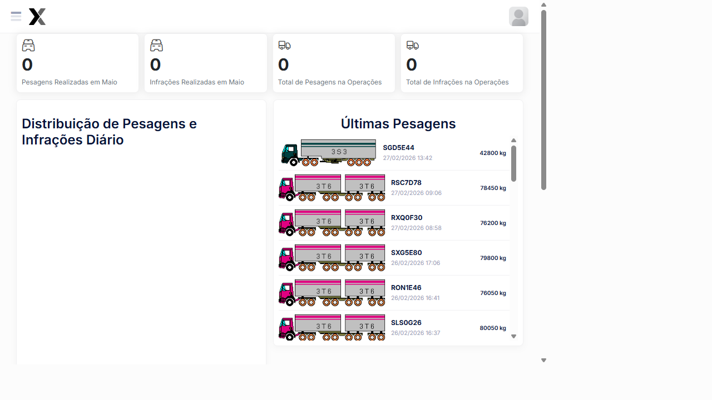

# Painel Principal (Dashboard)

O Painel Principal é a tela inicial do AxTon após a autenticação. Apresenta uma visão consolidada dos indicadores operacionais de pesagem veicular, incluindo contagens do mês, gráficos de distribuição e o histórico das últimas pesagens realizadas.

## Como acessar

- Ao realizar o login, o sistema redireciona automaticamente para o Dashboard
- Para retornar a qualquer momento: clique no **logo AxTon** no topo esquerdo ou no primeiro ícone do menu lateral

---

## Indicadores do Dashboard

O Dashboard apresenta **4 contadores principais** no topo da tela:

| Indicador | O que mostra | Inteligência |
|-----------|-------------|--------------|
| **Pesagens Realizadas no Mês** | Total de pesagens concluídas no mês atual | Atualizado em tempo real a cada pesagem finalizada |
| **Infrações Realizadas no Mês** | Total de infrações registradas no mês atual | Conta apenas infrações confirmadas (não descartadas) |
| **Total de Pesagens na Operação** | Soma de todas as pesagens da operação ativa | Reinicia quando uma nova operação é criada |
| **Total de Infrações na Operação** | Soma de todas as infrações da operação ativa | Permite comparar eficiência entre operações |

---

## Seções do Dashboard

### 1. Distribuição de Pesagens e Infrações Diário

Gráfico de barras que exibe a distribuição diária. O sistema calcula automaticamente:
- **Barras azuis:** Volume de veículos pesados por dia
- **Barras vermelhas:** Infrações geradas naquele dia
- **Tendência:** Permite identificar dias de maior movimento e dias com mais infrações

**Utilidade:** Dimensionar equipe de campo e planejar operações futuras.

### 2. Últimas Pesagens

Lista cronológica das pesagens mais recentes com atualização em tempo real:

| Campo | Descrição |
|-------|-----------|
| **Placa** | Placa do veículo pesado |
| **Data/Hora** | Momento exato da pesagem |
| **Peso (kg)** | Peso bruto total medido pela balança |

**Exemplos de registros:**
- `SGD5E44` — 27/02/2026 13:42 — **42.800 kg** *(dentro do limite)*
- `RSC7D78` — 27/02/2026 09:06 — **78.450 kg** *(excesso detectado)*
- `RXQ0F30` — 27/02/2026 08:58 — **76.200 kg** *(excesso detectado)*
- `TNJ5R62` — 26/02/2026 16:15 — **92.400 kg** *(sobrecarga severa)*

### 3. Comparativo de Pesagens e Infrações

Gráfico que correlaciona o total de pesagens com as infrações geradas por período. Permite avaliar:
- **Taxa de infração:** Percentual de veículos em excesso de peso
- **Eficiência da operação:** Quanto maior a taxa, mais assertivo é o posto

### 4. Alertas Operacionais

Painel de alertas em tempo real para ação imediata:
- Equipamentos offline
- Falhas de comunicação com balança
- Operações sem pesagem há mais de X horas

Quando não há alertas: *"Nenhum alerta recente encontrado"*.

### 5. Últimas Notas Fiscais

| Campo | Descrição |
|-------|-----------|
| **Chave NFe** | Número da nota fiscal eletrônica |
| **Placa** | Veículo associado |
| **Origem** | Cidade de origem da carga |
| **Destino** | Cidade de destino da carga |
| **Data/Hora** | Momento da captura |

**Utilidade:** Rastrear a documentação fiscal vinculada aos veículos pesados, cruzando dados de carga com peso medido.

---

## Menu Lateral — Estrutura Completa

O menu lateral exibe todos os módulos disponíveis conforme o perfil de acesso:

| Módulo | Ícone | Função principal |
|--------|-------|-----------------|
| **Iniciar Pesagem** | ⚖️ | Processo completo de pesagem |
| **Operações** | 🔧 | Gestão de operações em campo |
| **Tickets de Pesagens** | 📋 | Registro de todas as pesagens |
| **Exportação** | 📤 | Envio de infrações ao órgão |
| **Relatório de Pesagem** | 📊 | Consulta e PDF |
| **Sequenciais de Infração** | 🔢 | Numeração de autos |
| **Cadastros** | 📁 | Locais, Classificações |
| **Sistema** | ⚙️ | Configurações gerais |
| **Usuários** | 👤 | Gestão de acessos |
| **Perfis de Acesso** | 🔐 | Permissões por perfil |

---

## Passo a passo — Navegação no Dashboard

1. Após o login, observe os **4 indicadores no topo** para visão rápida do dia
2. Verifique o **gráfico diário** para identificar tendências
3. Confira as **últimas pesagens** para acompanhar o fluxo em tempo real
4. Verifique os **alertas** para ação imediata sobre problemas
5. Use o **menu lateral** para acessar qualquer módulo do sistema

---

## Dicas de uso

- **Acompanhe o Fluxo de Passagens** para dimensionar a equipe nos horários de pico
- **Verifique Alertas por Tipo** diariamente para identificar tendências (ex: muitos veículos sem MDF-e)
- **Use Origem das Cargas** para justificar estratégias de fiscalização por região
- **Monitore Alertas Recentes** para ação imediata em ocorrências críticas
- **Consulte Últimas Notas Fiscais** para validar a documentação fiscal dos veículos
