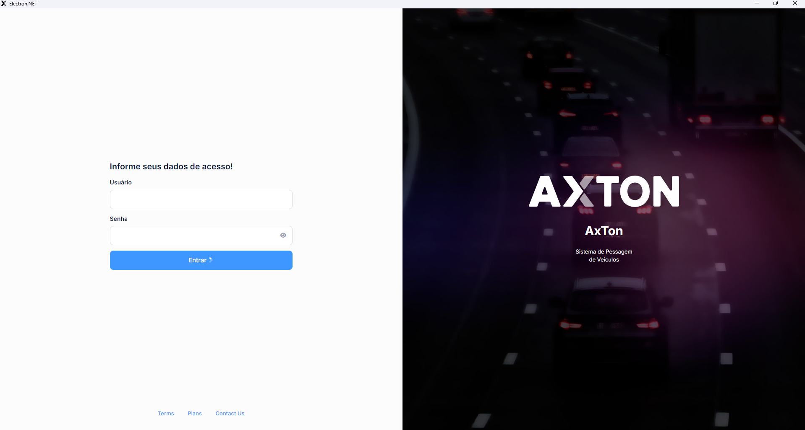

# Login

A tela de **Login** é o ponto de entrada do AxTon. Informe suas credenciais para acessar o sistema de pesagem veicular.

## Como acessar

Abra o navegador e acesse o endereço do AxTon fornecido pela organização.

## Campos

| Campo | Obrigatório | Descrição |
|-------|:-----------:|-----------|
| **Usuário** | Sim | Login cadastrado pelo administrador |
| **Senha** | Sim | Senha de acesso |

## Passo a passo

1. Acesse o endereço do AxTon no navegador
2. Informe o **Usuário** e a **Senha**
3. Clique em **Entrar**
4. O sistema redireciona para o **Dashboard**

## Primeiro acesso

Utilize as credenciais temporárias fornecidas pelo administrador. Altere a senha imediatamente após o primeiro acesso.

:::warning Segurança
Nunca compartilhe suas credenciais. Toda ação no sistema é registrada com o seu usuário no Log de Acesso.
:::

## Navegação Relacionada

- [Navegação](./navegacao) — Como usar o menu lateral
- [Perfis de Acesso](../controle-acesso/perfis-acesso) — Níveis de permissão

## Problemas comuns

| Problema | Solução |
|----------|---------|
| Senha incorreta | Tente novamente ou clique em **Esqueci minha senha** |
| Usuário bloqueado | Contate o administrador do sistema |
| Página não carrega | Verifique a conexão com a rede interna |
| Acesso negado por IP | Solicite a inclusão do seu IP em Controle de Acesso → Acessos por IP |

| Tipo | Página |
|------|--------|
| Próximo | [Navegação](./navegacao) |
| Relacionado | [Controle de Acesso](../controle-acesso/configurar-permissoes) |

| Campo | Obrigatório | Descrição |
|-------|:-----------:|-----------|
| **Nome do Usuário | Sim | Nome de Usuário cadastrado no sistema |
| **Senha** | Sim | Senha de acesso do Usuário |

## Passo a passo

1. Informe o **Nome do Usuário no campo correspondente
2. Informe a **Senha** de acesso
3. Clique no botão **ENTRAR**

## Recuperação de senha

Caso a senha tenha sido esquecida, clique no link **Esqueceu a Senha?** disponível na tela de Login. O sistema enviará as instruções de recuperação para o endereço de e-mail cadastrado no perfil do Usuário.

:::warning Atenção
Após múltiplas tentativas incorretas de Login, a conta poderá ser temporariamente bloqueada por segurança. Nesse caso, entre em contato com o administrador do sistema.
:::

## Segurança

- Nunca compartilhe suas credenciais de acesso com outros usuários
- Altere sua senha imediatamente no primeiro acesso ao sistema
- Reporte ao administrador qualquer acesso suspeito em seu nome no [Log de Acesso](../controle-acesso/logs-acesso)

## Relacionado

- [Navegação](./navegacao) — Estrutura do menu lateral e módulos disponíveis
- [Dashboard](./dashboard) — Tela inicial com indicadores operacionais
- [Controle de Acesso](../controle-acesso/configurar-permissoes) — Perfis e permissões de usuário

## Perguntas frequentes

**O que fazer quando minha conta é bloqueada após múltiplas tentativas de login?**
Entre em contato com o administrador do sistema, que pode desbloquear a conta em **Controle de Acesso → Usuários**. Para evitar novos bloqueios, nunca tente adivinhar a senha — use sempre o link **Esqueceu a Senha?** para recuperá-la.

**Como recuperar o acesso quando não sei mais minha senha?**
Clique em **Esqueceu a Senha?** na tela de login. O sistema envia as instruções de recuperação para o e-mail cadastrado no seu perfil. Se não tiver acesso ao e-mail, solicite ao administrador que redefina sua senha manualmente.

**Por que recebo a mensagem "Acesso negado por IP" mesmo com as credenciais corretas?**
O sistema possui controle de acesso por IP. Seu endereço de rede não está autorizado. Solicite ao administrador que inclua seu IP na lista permitida em **Controle de Acesso → Acessos por IP**.

## Erros comuns

| Erro | Causa | Solução |
|------|-------|----------|
| "Usuário ou senha inválidos" | Credenciais incorretas ou Caps Lock ativo | Verifique o teclado e tente novamente; use **Esqueceu a Senha?** se necessário |
| Conta bloqueada após tentativas | Política de segurança de tentativas máximas | Solicite ao administrador o desbloqueio em **Usuários** |
| Página de login não carrega | Problema de rede ou servidor offline | Verifique conectividade com a rede interna e contate o suporte |
| "Acesso negado por IP" | IP do dispositivo não cadastrado | Solicite inclusão do IP em **Controle de Acesso → Acessos por IP** |

## Integração com outros módulos

| Módulo | Como se relaciona com o Login |
|--------|-------------------------------|
| **Controle de Acesso → Usuários** | Cadastro de credenciais e definição de perfil de cada usuário |
| **Controle de Acesso → Perfis de Acesso** | O perfil vinculado ao usuário determina os módulos disponíveis após o login |
| **Controle de Acesso → Acessos por IP** | Restringe de quais endereços IP o login pode ser realizado |
| **Logs de Acesso** | Registra cada tentativa de login (sucesso e falha) para auditoria |
