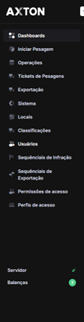

# Navegação

O AxTon possui uma interface organizada em menu lateral fixo, que permite o acesso a todos os módulos disponíveis conforme o perfil de acesso do Usuário autenticado.

## Estrutura da interface

| Elemento | Descrição |
|----------|-----------|
| **Menu lateral** | Use Dashboard à esquerda com a lista de módulos e categorias do sistema |
| **Área de conteúdo** | Região central onde as telas de cada módulo são exibidas |
| **Barra superior** | Exibe o nome do sistema, nome do Usuário autenticado e opção de sair |

## Módulos disponíveis

O menu lateral do AxTon é organizado com itens diretos e duas categorias expansíveis:

### Itens diretos

| Item do menu | Descrição |
|---|---|
| **Iniciar Pesagem** | Postos e início do processo de pesagem |
| **Operações** | Cadastro e gestão de operações de fiscalização |

## Dicas de navegação

| Atalho | Função |
|--------|--------|
| Clique no logo | Volta à página inicial |
| Menú recolhível | Clique na seta para expandir/recolher categorias |
| Busca | Utilize o campo de busca para localizar menus rapidamente |

:::tip
O menu exibe apenas os módulos que o perfil do usuário tem permissão de acessar. Se algum módulo estiver oculto, solicite ao administrador a concessão de permissão.
:::

## Estrutura geral do AxTon

| Módulo | Função |
|--------|--------|
| **Cadastros Básicos** | Postos, equipamentos, tipos, modelos |
| **Veículos** | Classificações, marcas, modelos |
| **Pesagem** | Tickets, reclassificar, liberar |
| **Operações** | Alertas, monitoramento, eventos |
| **Medições** | Contratos, índices, criar medição |
| **Relatórios** | Infrações, fluxo, OCR, Power BI |
| **Controle de Acesso** | Perfis, usuários, permissões |

| **Tickets de Pesagens** | Tickets em aberto e fechados |
| **Exportação** | Exportação de Infrações para o órgão autuador |
| **Sistema** | Configurações gerais, câmera IP e dados do órgão |
| Relatório de Pesagem** | Relatório de passagens e pesagens realizadas |
| **Sequenciais de Infração | Faixas de numeração sequencial |

### Categorias expansíveis

| Categoria | Itens |
|---|---|
| **Cadastros** | Locais, Classificações, Sequenciais de Infração |
| **Administração** | Usuários Permissões de acesso, Perfis de acesso |

:::tip Dica de navegação
Clique em uma categoria (Cadastros ou Administração) para expandir ou recolher os itens.
:::

## Relacionado

- [Login](./login)
- [Dashboard](./dashboard)
- [Perfis de Acesso](../administracao/perfis-acesso)
- [Permissões de Acesso](../administracao/permissoes)

## Orientações de navegação

- O menu exibe somente os módulos que o perfil do usuário tem permissão de acessar
- Itens ausentes no menu indicam permissões não concedidas — solicite ao administrador se necessário
- Use o breadcrumb no topo para entender em qual tela você está e navegar de volta sem perder o contexto
- Em dispositivos com tela pequena, o menu pode ser recolhido automaticamente para melhor aproveitamento de espaço
