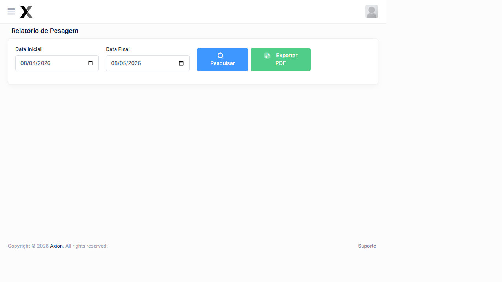

# Relatório de Pesagem

O Relatório de Pesagem** consolida todas as pesagens realizadas em um período, permitindo consulta e exportação em PDF para fins de auditoria e controle operacional.

## Como acessar

**Menu lateral** → Relatório de Pesagem**

## Filtros disponíveis

| Campo | Descrição |
|-------|-----------|
| **Data Inicial** | Data de início do período da consulta |
| **Data Final** | Data de encerramento do período |

## Ações

| Ação | Descrição |
|------|-----------|
| **Pesquisar** | Consultar as pesagens do período selecionado |
| **Exportar PDF** | Gerar arquivo PDF com os dados do Relatório |

## Dados exibidos

O Relatório lista todas as pesagens no período com:

| Coluna | Descrição |
|--------|-----------|
| **Data/Hora** | Momento da pesagem |
| **Placa** | Placa do Veículo |
| **Classe** | Classificação do Veículo |
| **PBT Medido** | Peso Bruto Total registrado (kg) |
| **PBT Regulamentado** | Limite legal da classificação |
| **Resultado** | Regular ou Infração |
| **Operação** | Operação vinculada |
| **Operador** | Usuário que realizou a pesagem |

## Passo a passo

1. No menu lateral, clique em Relatório de Pesagem**
2. Selecione a **Data Inicial** e **Data Final** do período
3. Clique em **Pesquisar**
4. Revise os dados na tela
5. Clique em **Exportar PDF** para gerar o documento

:::tip Dica
Exporte o Relatório ao final de cada operação para manter o histórico de pesagens organizados por data e local.
:::

---

## Casos de uso

- **Auditoria diária de produção** — exporte o PDF ao final de cada operação para manter o histórico de pesagens
- **Verificação de veículo específico** — filtre por placa para confirmar se houve pesagem e qual foi o resultado
- **Compilação para medição contratual** — use o total de pesagens do período como dado de entrada para o boletim
- **Comprovante de regularidade** — exporte pesagens com resultado **Regular** para comprovar o tratamento correto de um veículo

## Erros comuns

| Problema | Causa | Solução |
|----------|-------|----------|
| Relatório vazio | Nenhuma pesagem no período selecionado | Ampliar o período de consulta |
| PBT Medido zerado | Falha na leitura da balança | Verificar log de pesagem e calibrar |
| Peso "Regular" para veículo com excesso | Tolerância muito alta configurada | Revisar Configurações → Sistema → aba Infração |
| Exportação PDF muito demorada | Grande volume de registros | Reduzir o período ou exportar por posto |

## Relacionado

- [Relatório de Infrações](./relatorio-infracoes)
- [Processamento por Usuário](./processamento-por-usuario)
- [Tickets Fechados](../pesagem/ticket-fechado)

## Outros Relatórios

| Relatório | Descrição |
|---|---|
| Relatório de Infrações**](../relatorios/relatorio-infracoes) | Infrações registradas por período e status |
| [**Fluxo Diário de Veículos**](../relatorios/fluxo-diario-veiculos) | Volume de tráfego por hora e dia |
| Relatório de Discrepâncias**](../relatorios/relatorio-discrepancias) | Divergências entre pesagens e dados esperados |
| Relatório de Notas Fiscais**](../relatorios/relatorio-nfe) | Notas fiscais eletrônicas capturadas pelo sistema |
| [**Processamento de Imagens**](../relatorios/processamento-imagens) | Volume de imagens processadas no sistema |
| [**Processamento por Usuário**](../relatorios/processamento-por-usuario) | Produtividade por analista |
| [**Power BI**](../relatorios/power-bi) | Dashboards avançados de Análise |
| [**Mapa de Fluxo de Passagens**](../relatorios/mapa-fluxo-passagens) | Visualização geográfica do fluxo |
| [**Falhas Sequenciais**](../relatorios/falhas-sequenciais) | Análise de falhas na numeração sequencial |

## Perguntas frequentes

**Como verificar o histórico de pesagem de um veículo específico pelo número da placa?**
Este relatório não possui filtro por placa. Para consultar o histórico de um veículo específico, use a funcionalidade **Operações → Consulta de Placas**, que permite buscar todas as passagens de uma placa em qualquer período.

**O que fazer quando o PBT Medido aparece zerado no relatório?**
PBT Medido zerado indica falha na leitura da balança durante aquela pesagem. Acesse o ticket correspondente em **Pesagem → Tickets Fechados**, verifique o log do evento e registre uma ocorrência em **Operações → Eventos de Equipamentos** para rastreabilidade e cálculo de disponibilidade.

**É possível exportar o relatório de pesagem em Excel além do PDF?**
A exportação disponível neste relatório é em **PDF**. Para obter os dados em formato tabular (Excel/CSV), use o **Relatório de Infrações** ou o **Processamento de Imagens**, que oferecem exportação em CSV para análise avançada.

## Integração com outros módulos

| Módulo | Como se relaciona com Relatório de Passagens |
|--------|-----------------------------------------------|
| **Pesagem → Tickets Fechados** | Fonte dos dados de pesagem exibidos no relatório |
| **Operações** | Os dados são filtrados pela operação e local selecionados |
| **Medições → Criar Medição** | O volume de pesagens do período é dado de entrada para o boletim contratual |
| **Relatório de Infrações** | Cruza pesagens com infrações para análise de conformidade do período |

## Exemplo prático

**Cenário**: O fiscal quer verificar se um caminhão especifico (placa MNO-3R45) que passou pelo posto de pesagem na semana passada foi autuado ou passou como regular.

**Passo a passo**:

1. No menu lateral, clique em **Relatório de Pesagem**
2. Defina **Data Inicial** = dia da suspeita e **Data Final** = mesmo dia
3. Clique em **Pesquisar**
4. Localize a placa MNO-3R45 na lista de resultados
5. Verifique a coluna **Resultado**: se "Infração", o veículo foi autuado; se "Regular", estava dentro do limite
6. Se necessário, exporte o **PDF** para comprovante oficial com todos os dados da pesagem

**Resultado**: O relatório mostra que o veículo pesou 38.500 kg (limite de 35.000 kg) e foi autuado corretamente. O PDF exportado é anexado ao processo administrativo como evidência da pesagem.
