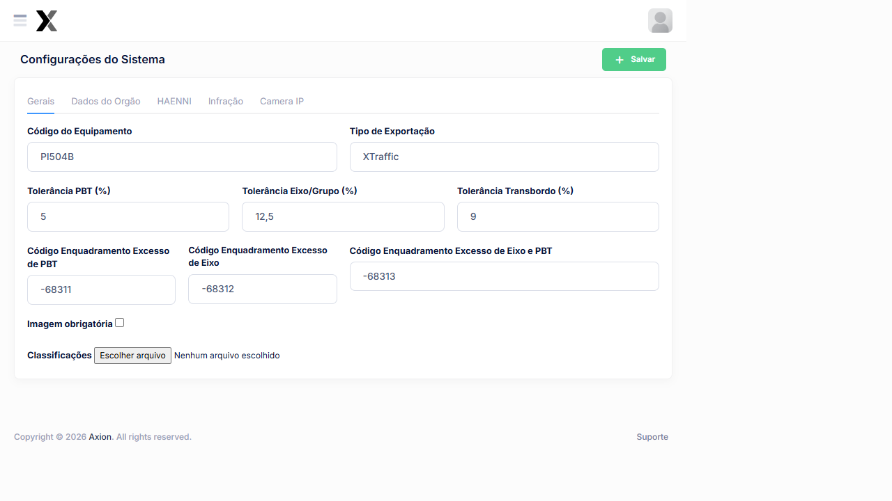

---
sidebar_position: 1
title: Configurações do Sistema
description: Configurações gerais, dados do órgão, HAENNI, Infração e câmera IP no AxTon
---

# Configurações do Sistema



A tela de Configurações do Sistema** centraliza todos os parâmetros operacionais do AxTon. Organizada em abas, cobre desde dados do órgão fiscalizador até a integração com a balança e o AxHub.

## Como acessar

**Menu lateral** → **Sistema**

## Abas disponíveis

| Aba | Descrição |
|-----|-----------|
| **Gerais** | Parâmetros gerais do sistema e integração com AxHub |
| **Dados do Órgão** | Informações do órgão fiscalizador |
| **HAENNI** | Configuração da balança HAENNI |
| Infração | Parâmetros de cálculo e enquadramento de Infrações |
| **Câmera IP** | Configuração da câmera de captura de imagens |

---

## Aba Gerais

| Campo | Descrição |
|-------|-----------|
| **Código do Equipamento | Identificador único deste Equipamento de pesagem |
| **Tipo de Exportação** | XTraffic ou AxHub (formato dos lotes de Infração |
| **Imagem obrigatória** | Exige foto da pesagem para finalizar o ticket |
| **Url AxHub** | Endereço de integração com o sistema AxHub |
| **Chave de Api** | Token de autenticação do AxHub |

---

## Aba Infração — Cálculos e Tolerâncias

está aba define os **limites de tolerância** aplicados antes de gerar uma Infração

| Campo | Descrição |
|-------|-----------|
| **Tolerância PBT (%)** | Percentual acima do PBT regulamentado que não gera Infração |
| **Tolerância Eixo/Grupo (%)** | Percentual de tolerância por eixo |
| **Tolerância Transbordo (%)** | Tolerância específica para transbordo |
| **Cód. Enquadramento Excesso de PBT** | Código legal do enquadramento |
| **Cód. Enquadramento Excesso de Eixo** | Código legal do enquadramento |
| **Cód. Enquadramento Excesso Eixo/PBT** | Código legal do enquadramento |

### Como funcionam os cálculos de Infração

#### Infração de Excesso de PBT

Ocorre quando o **PBT Regulamentado do Veículo for maior que 50.000 kg**.

```
PBT Considerado = PBT Regulamentado + (PBT Regulamentado × Tolerância PBT %)
Excesso de PBT = PBT Medido - PBT Considerado
```

**Exemplo:**
- PBT Regulamentado: 60.000 kg
- Tolerância PBT: 5%
- PBT Considerado: 60.000 + (60.000 × 5%) = **63.000 kg**
- PBT Medido: 65.000 kg
- **Excesso: 65.000 - 63.000 = 2.000 kg** → Infração gerada

#### Infração de Excesso de Eixo

Ocorre quando o peso em um ou mais eixos supera o limite regulamentado + tolerância.

```
Peso Eixo Considerado = Peso Limite Eixo + (Peso Limite Eixo × Tolerância Eixo %)
Excesso de Eixo = Peso Eixo Medido - Peso Eixo Considerado
```

---

## Aba HAENNI — Configuração da Balança

Configura a integração com a balança veicular HAENNI:

| Campo | Descrição |
|-------|-----------|
| **URL do Servidor** | Endereço do servidor da balança |
| **Hnuid** | Identificador único do hardware HAENNI |
| **Classe** | Classe do Equipamento |
| **Modelo** | Modelo da balança |
| **Serial** | Número de série |
| **Nº Lacre** | Número do lacre de verificação metrólogica |
| **Verificada** | Balança verificada pelo órgão metrólogico |
| **Validada** | Balança validada para uso |
| **Aferição** | Data da última aferição |
| **Validade da Aferição** | Data de expiração da aferição |

:::warning Validade da Aferição
O sistema bloqueia o uso da balança quando a **validade da aferição** expirar. Mantenha o certificado sempre atualizado.
:::

---

## Aba Dados do Órgão

| Campo | Descrição |
|-------|-----------|
| **Código do Órgão** | Código oficial do órgão fiscalizador |
| **Nome do Órgão** | Nome completo (ex: SEINFRA-PI) |
| **Título do Órgão** | Descrição que aparece nos documentos gerados |

:::tip Dica
Após alterar qualquer Configuração clique em **Salvar** no topo da tela para persistir as mudanças.
:::

## Veja também

| Funcionalidade | Descrição |
|---|---|
| [**Câmera IP**](../sistema/camera-ip) | Configuração da câmera de captura |
| [**Sequênciais de Infração**](../cadastros/sequencial-infracao) | Numeração dos autos |
| [**Sequênciais de Exportação**](../infracoes/exportacao) | Numeração dos lotes |
