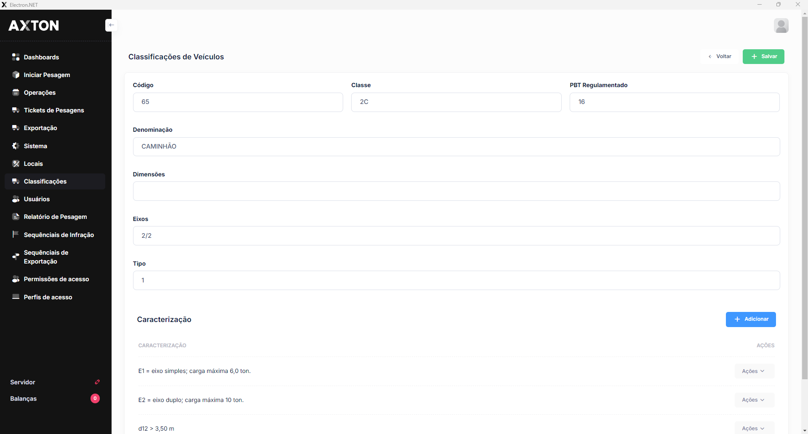

---
sidebar_position: 2
title: Marcas de Veículos
description: Cadastro de marcas/fabricantes de Veículos
---

# Marcas de Veículos

Cadastro de marcas/fabricantes de Veículos Estes dados são utilizados automaticamente nas operações de pesagem e triagem de Infrações

## Como acessar

**Menu lateral** → Veículos → **Marcas de Veículos

## Listagem

A tela exibe todos os registros cadastrados, com opção de pesquisa e filtro.

### Colunas

| Coluna | Descrição |
|--------|-----------|
| **Código** | Identificador único |
| **Descrição** | Nome/descrição do registro |
| **Ativo** | Status (Ativo/Inativo) |

### Passo a passo — Cadastrar

1. Acesse Veículos → **Marcas de Veículos
2. Clique em **+ Novo**
3. Preencha o Código e a Descrição
4. Marque como Ativo
5. Clique em **Salvar**
