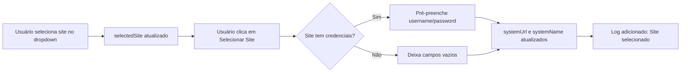
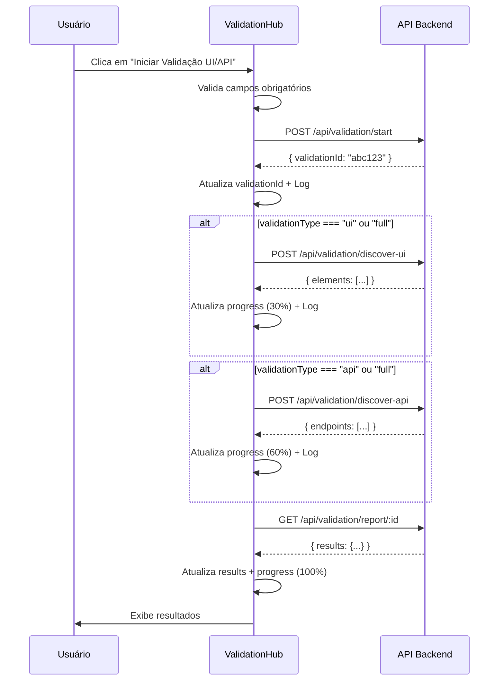
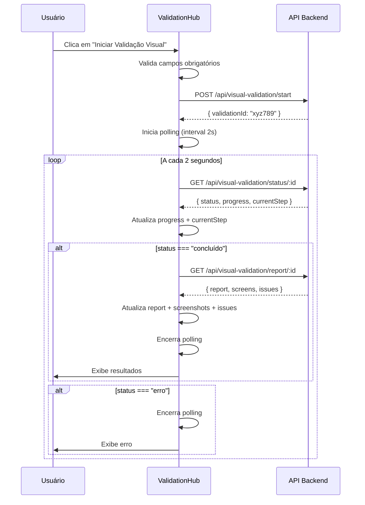
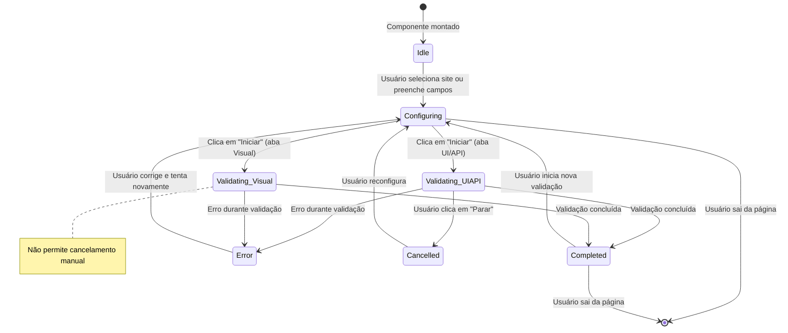
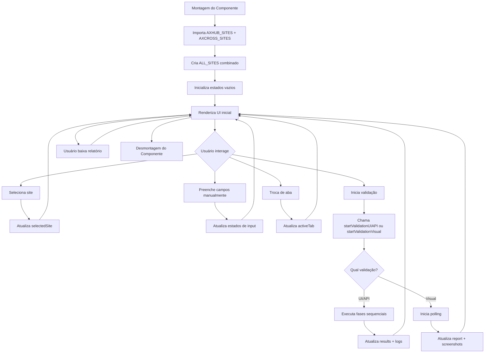
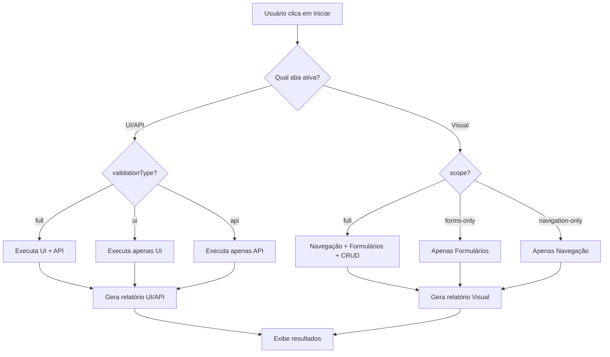

# 🔄 Diagramas - ValidationHub.jsx

## 📐 Arquitetura de Componentes

```
ValidationHub
│
├── Header
│   └── Título + Descrição
│
├── TabSelector
│   ├── Tab: UI/API
│   └── Tab: Visual
│
├── SiteSelector
│   ├── Dropdown (ALL_SITES)
│   ├── Botão "Selecionar Site"
│   └── Toggle "Modo Manual"
│
├── ConfigurationForm
│   ├── URL do Sistema (input)
│   ├── Nome do Sistema (input, apenas UI/API)
│   ├── Credenciais (username + password)
│   ├── Tipo/Escopo (radio buttons, dinâmico)
│   └── Botão Iniciar/Parar
│
├── ProgressSection (condicional)
│   ├── Barra de Progresso (0-100%)
│   └── Step Atual (texto)
│
├── LogsSection (condicional, apenas UI/API)
│   └── Lista de Logs (time + message + type)
│
└── ResultsSection (condicional, dinâmico)
    ├── [UI/API] Summary Cards + Details
    │   ├── Card: Elementos UI
    │   ├── Card: Endpoints API
    │   ├── Card: Status
    │   └── JSON Details
    │
    └── [Visual] Screenshots + Issues
        ├── Grid de Screenshots
        ├── Lista de Issues
        └── Report Summary
```

---

## 🔀 Fluxo de Dados

### Fluxo 1: Seleção de Site



### Fluxo 2: Validação UI/API



### Fluxo 3: Validação Visual



---

## 🎛️ Máquina de Estados



---

## 🗂️ Estrutura de Dados

### ALL_SITES (Array de Sites)

```typescript
interface Site {
  id: string;                // "economia-ipempe"
  nome: string;             // "IPEM-PE Economia"
  url: string;              // "https://economia.axhub.axion.ws"
  estado: string;           // "PE"
  orgao: string;            // "Instituto de Pesos e Medidas de PE"
  tipo: string;             // "Metrologia"
  platform: string;         // "AxHub" ou "AxCross"
  status: string;           // "ativo"
  credentials?: {           // Opcional
    username: string;
    password: string;
  };
  // ... outros campos específicos
}
```

### Results (UI/API)

```typescript
interface ValidationResults {
  validationId: string;
  status: string;           // "Concluído", "Em andamento", "Erro"
  duration: string;         // "45s"
  ui?: {
    totalElements: number;
    buttons: number;
    inputs: number;
    forms: number;
  };
  api?: {
    totalEndpoints: number;
    getCount: number;
    postCount: number;
  };
}
```

### Report (Visual)

```typescript
interface VisualValidationReport {
  validationId: string;
  status: string;
  screens: Array<{
    name: string;           // "Login", "Dashboard"
    screenshot: string;     // Base64 ou URL
  }>;
  issues: Array<{
    title: string;
    description: string;
    severity: "high" | "medium" | "low";
    location?: string;
  }>;
}
```

### Logs (UI/API)

```typescript
interface Log {
  time: string;             // "10:23:45"
  message: string;          // "Validação iniciada (ID: abc123)"
  type: "info" | "success" | "warning" | "error";
}
```

---

## 🔄 Ciclo de Vida do Componente



---

## 📊 Fluxo de Decisão: Tipo de Validação



---

## 🎨 Hierarquia Visual de Componentes

```
╔═══════════════════════════════════════════════════════════╗
║                 🔬 Validation Hub                        ║
║          Central unificada de validação                  ║
╚═══════════════════════════════════════════════════════════╝
╔═════════════════════════╦═════════════════════════════════╗
║  📋 Validação UI/API   ║  👁️ Validação Visual          ║
╚═════════════════════════╩═════════════════════════════════╝
╔═══════════════════════════════════════════════════════════╗
║ 🌍 Seleção de Site                                       ║
║ ┌─────────────────────────────────────────────────────┐  ║
║ │ [AxHub - IPEM-PE Economia ▼]  [✓ Selecionar Site] │  ║
║ └─────────────────────────────────────────────────────┘  ║
║ ☐ Modo Manual                                            ║
╚═══════════════════════════════════════════════════════════╝
╔═══════════════════════════════════════════════════════════╗
║ ⚙️ Configuração                                          ║
║ ┌─────────────────────────────────────────────────────┐  ║
║ │ 🌐 URL: [https://economia.axhub.axion.ws          ]│  ║
║ │ 📄 Nome: [AxHub - IPEM-PE Economia                ]│  ║
║ │ 🛡️ User: [admin     ]  🛡️ Pass: [********        ]│  ║
║ │                                                      │  ║
║ │ ⚡ Tipo: ( ) Completa (●) Apenas UI ( ) Apenas API │  ║
║ └─────────────────────────────────────────────────────┘  ║
║                                                           ║
║               [▶️ Iniciar Validação UI/API]              ║
╚═══════════════════════════════════════════════════════════╝
╔═══════════════════════════════════════════════════════════╗
║ 📊 Progresso                              [⬇ Download]  ║
║ ┌─────────────────────────────────────────────────────┐  ║
║ │ ████████████████████░░░░░░░░░░░░░  75%            │  ║
║ └─────────────────────────────────────────────────────┘  ║
║ ⏱️ Analisando APIs e endpoints...                       ║
╚═══════════════════════════════════════════════════════════╝
╔═══════════════════════════════════════════════════════════╗
║ 📋 Logs                                                  ║
║ ┌─────────────────────────────────────────────────────┐  ║
║ │ 10:23:45 | ℹ️ Iniciando validação...                │  ║
║ │ 10:23:50 | ✓ Validação iniciada (ID: abc123)       │  ║
║ │ 10:24:10 | ✓ Descobertos 120 elementos UI          │  ║
║ │ 10:24:25 | ✓ Descobertos 25 endpoints API          │  ║
║ └─────────────────────────────────────────────────────┘  ║
╚═══════════════════════════════════════════════════════════╝
╔═══════════════════════════════════════════════════════════╗
║ ✅ Resultados                                            ║
║ ┌──────────┐ ┌──────────┐ ┌──────────┐                  ║
║ │ 👁️ UI   │ │ 🌐 API  │ │ ✅ Status │                  ║
║ │ 120 elem.│ │ 25 endp. │ │ Concluído │                  ║
║ └──────────┘ └──────────┘ └──────────┘                  ║
║                                                           ║
║ [JSON Details...]                                        ║
╚═══════════════════════════════════════════════════════════╝
```

---

## 🧩 Dependências de Estados

```mermaid
graph TD
    A[selectedSite] -->|Preenche| B[systemUrl]
    A -->|Preenche| C[systemName]
    A -->|Preenche| D[username/password]
    
    E[manualMode] -->|Desabilita| F[selectedSite]
    E -->|Habilita edição| B
    E -->|Habilita edição| C
    
    G[activeTab] -->|Controla visibilidade| H[validationType]
    G -->|Controla visibilidade| I[scope]
    G -->|Controla visibilidade| J[LogsSection]
    
    K[isValidating] -->|Desabilita| L[Todos os inputs]
    K -->|Desabilita| M[TabSelector]
    K -->|Habilita| N[Botão Parar]
    
    O[validationId] -->|Necessário para| P[Polling status]
    O -->|Necessário para| Q[Download relatório]
    
    R[results] -->|Exibe| S[ResultsSection UI/API]
    T[report] -->|Exibe| U[ResultsSection Visual]
```



---

**Última atualização**: 2026-06-20  
**Ferramenta**: Mermaid + Markdown  
**Status**: ✅ Completo
