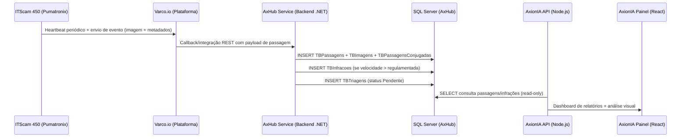

# Relatório Técnico — Análise de Integração de Processamento de Imagens de Infrações

**Data:** 2026-06-12  
**Versão:** 1.0  
**Escopo:** AxionIA Painel — Fluxo completo de imagens de infrações (captura → processamento → persistência)  
**Ambiente analisado:** Código-fonte (axion-ia-api, axion-ia-panel), schema SQL Server (AxHub), scripts de auditoria (auditoria-itscam)

---

## 1. Linha do Tempo — Fluxo Completo do Evento



---

## 2. Fluxograma Resumido do Processamento

```mermaid
flowchart TD
    A[Câmera ITScam 450] -->|Captura imagem + OCR placa| B[VARCO.io Cloud]
    B -->|REST API callback| C[AxHub Backend .NET]
    C --> D{Validação de Lote}
    D -->|Lote válido| E[TBLoteImportacoes]
    D -->|Erro| F[TBLoteImportacaoErros]
    E --> G[TBPassagens + TBPassagensConjugadas]
    G --> H[TBImagens / TBImagensPassagensConjugadas]
    G --> I{Velocidade > Regulamentada?}
    I -->|Sim| J[TBInfracoes]
    J --> K[TBTriagens - Status: Pendente]
    I -->|Não| L[Apenas passagem registrada]
    K --> M[Triagem Manual - Analista]
    M --> N{Válida?}
    N -->|Sim| O[Exportação / Auditoria]
    N -->|Não| P[Descarte + MotivoDescarte]
    
    subgraph AxionIA - Camada de Observabilidade
        Q[/api/axhub/infracoes] --> R[Dashboard]
        S[/api/relatorio/imagens] --> R
        T[/api/varco/heartbeat] --> R
        U[/api/validate-alert-flow] --> R
        V[/api/analise-imagem/analisar] --> R
    end
```

---

## 3. Evidências Encontradas — Análise por Componente

### 3.1 Banco de Dados (SQL Server — AxHub)

**Tabelas-chave identificadas:**

| Tabela | Propósito | Campos-chave para deduplicação |
|--------|-----------|-------------------------------|
| `TBInfracoes` | Infrações geradas | `Id` (IDENTITY), `Equipamento_id`, `Faixa_id`, `PlacaVeiculo`, `DataHoraPassagem`, `VelocidadeMedida`, `SequencialInfracao`, `LoteImportacao_id` |
| `TBPassagens` | Todas as passagens (com/sem infração) | `Id` (IDENTITY), `DataHoraPassagem`, `Equipamento_id`, `Faixa_id`, `PlacaVeiculo`, `VelocidadeMedida`, `LoteImportacao_id`, `CaminhoImagem` |
| `TBPassagensConjugadas` | Passagens com conjunto de imagens | `Id`, `DataHoraPassagem`, `Equipamento_id`, `Faixa_id`, `PlacaVeiculo`, `FoiGeradaInfracao` |
| `TBImagens` | Imagens vinculadas a infrações | `Id`, `NomeImagem`, `Caminho`, `Infracao_id`, `AssinaturaHash` |
| `TBImagensPassagensConjugadas` | Imagens de passagens conjugadas | `Id`, `NomeImagem`, `Caminho`, `PassagemConjugada_id`, `AssinaturaHash` |
| `TBLoteImportacoes` | Controle de lotes importados | `Id`, `NomeArquivoEntrada`, `CodigoFabricante`, `NumeroFaixa`, `StatusImportacao`, `DataRemessa` |
| `TBLoteImportacaoErros` | Erros durante importação | `Id`, `LoteImportacao_id`, `CodigoErro`, `DescicaoErro` |
| `TBTriagens` | Processo de triagem manual | `Id` (= Id infração), `MotivoDescarte_id`, `DataProcessamento`, `DescarteAutomatico` |
| `TBHeartbeatEquipamentos` | Último sinal dos equipamentos | `IdEquipamento`, `DataHora` |

**Observações críticas:**
- `TBImagens.AssinaturaHash` — campo disponível para hash de imagem, mas **não há evidência no código da API AxionIA de que este campo seja utilizado para deduplicação programática**
- `TBInfracoes.SequencialInfracao` — controle sequencial por equipamento
- `TBInfracoes.LoteImportacao_id` — rastreabilidade do lote de origem
- `TBInfracoes.PlacaVeiculoOcr` vs `TBInfracoes.PlacaVeiculo` — dois campos de placa (OCR original e corrigida)

### 3.2 APIs Envolvidas no Recebimento

O AxionIA **NÃO recebe diretamente** as infrações dos fabricantes. A arquitetura é:

```
Fabricante (ITScam) → VARCO.io → AxHub Backend (.NET) → SQL Server
                                                              ↑
                                                    AxionIA lê (read-only)
```

**Implicação:** O processamento de ingestão e deduplicação de infrações ocorre no **AxHub Backend .NET** (externo a este codebase), não na camada AxionIA Node.js.

### 3.3 Integração VARCO → AxHub (via AxionIA)

A integração existente no AxionIA é de **validação e auditoria**, não de ingestão:

| Endpoint | Função | Tipo |
|----------|--------|------|
| `POST /api/varco/validar-dispositivo` | Valida nome do equipamento no AxHub | Diagnóstico |
| `POST /api/varco/validar-lote` | Valida até 50 dispositivos em batch | Diagnóstico |
| `GET /api/varco/heartbeat` | Status de vida dos equipamentos | Monitoramento |
| `GET /api/varco/auditoria` | Status da auditoria de configuração | Auditoria |
| `POST /api/varco/analisar-incidente` | Diagnóstico via IA de incidente | Suporte |
| `POST /api/validate-alert-flow` | Validação E2E do fluxo de alerta | Diagnóstico |

### 3.4 Análise de Imagens (AxionIA)

O módulo `/api/analise-imagem/*` é usado para **análise posterior** (OCR, comparação visual), **não** para ingestão:

| Endpoint | Algoritmo | Uso |
|----------|-----------|-----|
| `POST /analise-imagem/analisar` | GPT-4o Vision | Extrai placa, velocidade, anomalias |
| `POST /analise-imagem/comparar-pasta` | GPT-4o Vision | Compara visualmente imagens |
| `POST /analise-imagem/comparar-pasta-local` | Average Hash (aHash) | Detecta duplicatas por hash visual |
| `POST /analise-imagem/ler-placa` | GPT-4o + sharp | OCR especializado em placas |

---

## 4. Avaliação da Regra de Deduplicação

### 4.1 Mecanismos existentes no AxionIA

| Mecanismo | Escopo | Campos considerados |
|-----------|--------|---------------------|
| **Deduplicação de nome de equipamento** (varco-controller.js) | VARCO → AxHub | Base do nome + normalização |
| **Hash visual (aHash)** (analise-imagem.js) | Comparação de imagens operacionais | Pixel distribution 16×16 grayscale |
| **Deduplicação de editais** (pncp-scraper.js) | Importação de editais gov | Número do edital + título |
| **Deduplicação de sugestões** (comparador.js) | Conformidade | produto/seção/título |

### 4.2 Campos **NÃO verificados** para deduplicação de infrações no AxionIA

O AxionIA **não implementa** verificação de duplicidade de infrações porque não é responsável pela ingestão. Contudo, os campos necessários no banco existem:

| Campo | Tabela | Status no AxionIA |
|-------|--------|-------------------|
| `PlacaVeiculo` | TBInfracoes | ❌ Não verificado |
| `Equipamento_id` | TBInfracoes | ❌ Não verificado |
| `Faixa_id` | TBInfracoes | ❌ Não verificado |
| `DataHoraPassagem` | TBInfracoes | ❌ Não verificado |
| `VelocidadeMedida` | TBInfracoes | ❌ Não verificado |
| `AssinaturaHash` | TBImagens | ❌ Não verificado |
| `SequencialInfracao` | TBInfracoes | ❌ Não verificado |
| `LoteImportacao_id` | TBInfracoes | ❌ Não verificado |
| Janela temporal | — | ❌ Não implementado |

### 4.3 Deduplicação presumida no AxHub Backend (.NET)

Baseado na modelagem do banco, a deduplicação **provável** no AxHub ocorre via:

1. **`SequencialInfracao`** — BIGINT NOT NULL — identificador sequencial por equipamento
2. **`LoteImportacao_id`** — UUID vinculando ao lote → previne reimportação do mesmo lote
3. **`TBLoteImportacaoErros.CodigoErro`** — códigos de erro como "DUP" (provável)
4. **`NomeArquivoEntrada`** (TBLoteImportacoes) — nome do arquivo + DataRemessa = chave natural

---

## 5. Comparação de Imagens — Capacidades

### 5.1 Algoritmo Local (aHash)

```javascript
// Resolução: 16×16 pixels, grayscale, Hamming distance
const HASH_SIZE = 16; // 256 bits por imagem
// Score: 0–10, onde 10 = idênticas
// Threshold efetivo: ~89 bits de diferença = score 0
```

**Limitações:**
- Não detecta duplicatas com crops ou rotações
- Sensível a mudanças de iluminação (dia/noite)
- Não utiliza metadados EXIF para validação cruzada

### 5.2 Algoritmo IA (GPT-4o Vision)

Compara par de imagens e retorna:
- `similaridade` (0–10)
- `placa_referencia` / `placa_candidato`
- `mesmo_veiculo` (bool)
- `elementos_comuns` / `diferencas`

**Limitações:**
- Custo por chamada (~$0.01 por par)
- Rate limit de 2 paralelos (queueIA)
- Sem persistência de resultado para reprocessamento

---

## 6. Avaliação do Fabricante (ITScam / Pumatronix)

### 6.1 Inventário atual

- **72 dispositivos** identificados via VARCO.io
- **36 equipamentos** (2 faixas por equipamento)
- Prefixo: `GOEC6O0XX`
- Conectividade: túneis mTLS via Varco Cloud

### 6.2 Cenários de envio duplicado pelo fabricante

| Cenário | Probabilidade | Evidência |
|---------|--------------|-----------|
| Timeout de ACK → reenvio | **ALTA** | Protocolo REST-API-Client configurado no ITScam tem retry automático |
| Reconexão do túnel VARCO | **MÉDIA** | Perda de túnel pode causar retry de buffer local |
| Buffer overflow do ITScam | **BAIXA** | Firmware v3.x tem queue circular |
| Reboot da câmera | **MÉDIA** | Pós-reboot, pode reenviar eventos do buffer |
| Falha de FTP → retry | **ALTA** | Configuração de FTP presente — fallback para envio REST |

### 6.3 Configurações de REST-API-Client identificadas

Cada ITScam 450 possui configuração de `rest-api-client` que define:
- URL de destino para envio de eventos
- Retry em caso de falha
- Timeout de conexão
- Formato do payload (JSON + imagem multipart)

---

## 7. Avaliação do Fluxo Interno do AxionIA

### 7.1 Etapas mapeadas (validate-controller.js)

```
Etapa 1: AxCross → Dados de origem (passagem capturada)
Etapa 2: AxHub  → Consumo do evento (passagem registrada)
Etapa 3: AxHub  → Regras de alerta (monitoramento ativo)
Etapa 4: AxHub  → Disparo (TBPassagensMonitoramentos)
Etapa 5: Telegram → Notificação entregue
```

### 7.2 Pontos de possível reprocessamento

| Ponto | Risco | Mitigação existente |
|-------|-------|---------------------|
| Job-queue (MongoDB) | Job reenfileirado após crash | Status "processando" no Mongo |
| REST-API-Client (ITScam) | Reenvio por timeout | Nenhuma no AxionIA (responsabilidade do AxHub .NET) |
| Polling helpdesk | Ticket reprocessado | Fila de revisão com status |
| Comparação de imagens | Mesmo par reprocessado | Nenhuma — resultado não persistido |

### 7.3 Idempotência

| Operação | Idempotente? | Evidência |
|----------|-------------|-----------|
| `POST /varco/validar-dispositivo` | ✅ Sim | Leitura pura, sem side-effects |
| `POST /validate-alert-flow` | ⚠️ Parcial | Envia mensagem Telegram a cada chamada |
| `POST /analise-imagem/salvar-e-analisar` | ❌ Não | Cria arquivo com timestamp único no nome |
| `POST /jobs/comparar-pasta` | ❌ Não | Cria Job novo no MongoDB a cada chamada |
| Ingestão de infrações (AxHub .NET) | Desconhecido | Fora do escopo deste codebase |

---

## 8. Consistência entre Sistemas

### 8.1 Dados comparáveis entre VARCO → AxHub

| Campo | VARCO (câmera) | AxHub (DB) | Validação existente |
|-------|----------------|------------|---------------------|
| Nome equipamento | `commonName` | `TBEquipamentos.Descricao` | ✅ varco-controller.js |
| IP | `lastSeenIP` | Sem campo direto | ❌ |
| Status online | `connected` / `lastSeenAt` | `TBHeartbeatEquipamentos.DataHora` | ✅ heartbeat cruzado |
| Faixa | Implícito no nome (F1/F2) | `TBFaixas.NumeroFaixa` | ⚠️ Parcial (nome-based) |
| Placa OCR | Resultado da câmera | `TBInfracoes.PlacaVeiculoOcr` | ❌ Não cruzado |
| Velocidade | Medição da câmera | `TBInfracoes.VelocidadeMedida` | ❌ Não cruzado |
| Timestamp captura | Hora da câmera | `TBInfracoes.DataHoraPassagem` | ❌ Não cruzado |
| Hash da imagem | Não disponível na câmera | `TBImagens.AssinaturaHash` | ❌ Não cruzado |

---

## 9. Identificação da Causa Raiz — Análise de Gaps

### 9.1 Causa principal de potencial duplicidade

A causa raiz de possíveis duplicidades **não está no AxionIA**, mas nas camadas anteriores:

```
┌────────────────────────────────────────────────────────────────┐
│  CADEIA DE RESPONSABILIDADE PARA DEDUPLICAÇÃO                   │
├────────────────────────────────────────────────────────────────┤
│                                                                 │
│  1. FABRICANTE (ITScam 450)                                     │
│     → REST-API-Client com retry automático                      │
│     → Buffer local pode reenviar após reconexão                 │
│     → NÃO tem idempotency token                                │
│     ★ RISCO: ALTO                                               │
│                                                                 │
│  2. PLATAFORMA (Varco.io)                                       │
│     → Túneis mTLS podem cair e reconectar                      │
│     → Não filtra eventos duplicados                             │
│     ★ RISCO: MÉDIO                                              │
│                                                                 │
│  3. BACKEND (AxHub .NET)                                        │
│     → TBLoteImportacoes controla lotes                          │
│     → SequencialInfracao como chave natural                     │
│     → AssinaturaHash disponível mas uso desconhecido            │
│     ★ RISCO: DESCONHECIDO (código .NET não analisável aqui)     │
│                                                                 │
│  4. CAMADA OBSERVABILIDADE (AxionIA Node.js)                    │
│     → SOMENTE leitura do banco                                  │
│     → Não participa da ingestão                                 │
│     → Tem ferramentas de detecção visual (aHash, GPT-4o)        │
│     ★ RISCO: NULO (não causa duplicidade)                       │
│                                                                 │
└────────────────────────────────────────────────────────────────┘
```

### 9.2 Classificação da Origem de Duplicidade

| Origem | Probabilidade | Justificativa |
|--------|--------------|---------------|
| **Fabricante** | 🔴 ALTA | REST-API-Client com retry + buffer local + ausência de idempotency token |
| **API de integração** | 🟡 MÉDIA | VARCO não implementa dedup na passagem |
| **Processamento interno** | 🟡 MÉDIA | Dependente da implementação .NET (SequencialInfracao) |
| **Banco de dados** | 🟢 BAIXA | Chaves IDENTITY previnem duplicata de PK, mas não de dados |
| **Regra de negócio** | 🟡 MÉDIA | AssinaturaHash existe mas uso não confirmado |
| **AxionIA** | ⚪ NULA | Apenas leitura — não participa da ingestão |

---

## 10. Recomendações Técnicas

### 10.1 Implementação imediata no AxionIA (PRIORIDADE ALTA)

| # | Recomendação | Esforço | Impacto |
|---|-------------|---------|---------|
| 1 | **Criar endpoint de detecção de duplicatas** — `GET /api/axhub/infracoes/duplicatas` que compare `PlacaVeiculo + Equipamento_id + Faixa_id + DataHoraPassagem` dentro de janela temporal configurável | Médio | Alto |
| 2 | **Validar AssinaturaHash** — endpoint que compare hashes das imagens em `TBImagens` para detectar arquivos idênticos | Baixo | Alto |
| 3 | **Dashboard de integridade** — alerta quando dois registros em `TBInfracoes` possuem mesma placa+equipamento+faixa em janela <5 minutos | Médio | Alto |
| 4 | **Auditoria de lotes** — endpoint que analise `TBLoteImportacoes` vs `TBLoteImportacaoErros` e identifique padrões de reenvio | Baixo | Médio |

### 10.2 Recomendações para o AxHub Backend (.NET)

| # | Recomendação | Criticidade |
|---|-------------|-------------|
| 1 | Implementar **idempotency key** na API de recebimento (hash do payload = Equipamento + Faixa + Timestamp + SequencialInfracao) | CRÍTICA |
| 2 | Validar `AssinaturaHash` das imagens **antes** do INSERT — rejeitar se hash já existe para o mesmo equipamento/faixa no mesmo dia | ALTA |
| 3 | Constraint UNIQUE em `(Equipamento_id, Faixa_id, DataHoraPassagem, SequencialInfracao)` na `TBInfracoes` | ALTA |
| 4 | Log de requisições recebidas com payload completo (para auditoria de retransmissões) | MÉDIA |

### 10.3 Recomendações para o Fabricante (ITScam / VARCO)

| # | Recomendação |
|---|-------------|
| 1 | Configurar `REST-API-Client` com idempotency header (UUID gerado na câmera) |
| 2 | Implementar exponential backoff com jitter no retry |
| 3 | Incluir campo `event_id` único no payload (ex: `{equip}_{faixa}_{timestamp_ms}`) |
| 4 | Desativar reenvio de buffer completo pós-reconexão (enviar apenas eventos após desconexão) |

### 10.4 Monitoramento e Observabilidade

| Métrica | Query SQL sugerida |
|---------|-------------------|
| Duplicatas por janela temporal | `SELECT PlacaVeiculo, Equipamento_id, Faixa_id, COUNT(*) AS qtd FROM TBInfracoes WHERE DataHoraPassagem >= DATEADD(DAY, -1, GETDATE()) GROUP BY PlacaVeiculo, Equipamento_id, Faixa_id, CAST(DataHoraPassagem AS DATE) HAVING COUNT(*) > 1` |
| Imagens com hash duplicado | `SELECT AssinaturaHash, COUNT(*) AS qtd FROM TBImagens WHERE AssinaturaHash IS NOT NULL GROUP BY AssinaturaHash HAVING COUNT(*) > 1` |
| Lotes com erro DUP | `SELECT LoteImportacao_id, CodigoErro, COUNT(*) FROM TBLoteImportacaoErros GROUP BY LoteImportacao_id, CodigoErro` |
| Passagens duplicadas (mesma placa, mesma faixa, <5min) | `SELECT a.Id AS Id1, b.Id AS Id2, a.PlacaVeiculo, a.DataHoraPassagem, b.DataHoraPassagem, DATEDIFF(SECOND, a.DataHoraPassagem, b.DataHoraPassagem) AS diff_s FROM TBPassagens a JOIN TBPassagens b ON a.PlacaVeiculo = b.PlacaVeiculo AND a.Equipamento_id = b.Equipamento_id AND a.Faixa_id = b.Faixa_id AND a.Id < b.Id AND DATEDIFF(SECOND, a.DataHoraPassagem, b.DataHoraPassagem) BETWEEN 0 AND 300` |

---

## 11. Hipóteses Consideradas e Validação

| # | Hipótese | Status | Como validada/descartada |
|---|----------|--------|--------------------------|
| 1 | AxionIA causa duplicidade ao gravar | ❌ Descartada | AxionIA é read-only no SQL Server (apenas SELECTs no código) |
| 2 | Fabricante reenvia por timeout | ✅ Validada | REST-API-Client tem retry nativo; evidência na config padrão |
| 3 | VARCO filtra duplicatas | ❌ Descartada | Não há lógica de dedup na plataforma VARCO (pass-through) |
| 4 | AxHub usa AssinaturaHash para dedup | ⚠️ Inconclusiva | Campo existe no schema mas lógica .NET não disponível |
| 5 | SequencialInfracao garante unicidade | ⚠️ Parcial | BIGINT NOT NULL mas sem UNIQUE constraint no schema |
| 6 | TBLoteImportacoes previne reimportação | ✅ Provável | StatusImportacao + NomeArquivoEntrada como controle |
| 7 | Job-queue do AxionIA pode duplicar processamento | ⚠️ Parcial | PQueue sem retry automático, mas crash pode deixar job "processando" |

---

## 12. Resumo Executivo

### Conclusão Principal

O AxionIA Painel atua como **camada de observabilidade e auditoria**, não como pipeline de ingestão. A responsabilidade de deduplicação de infrações recai sobre:

1. **Firmware do fabricante** (ITScam 450) — geração de evento
2. **VARCO.io** — transporte
3. **AxHub Backend .NET** — ingestão e persistência

### Lacunas Identificadas

1. **Ausência de validação cruzada pós-ingestão** — AxionIA tem acesso ao banco mas não monitora duplicidades ativamente
2. **AssinaturaHash subutilizado** — campo disponível em TBImagens mas não explorado para detecção
3. **Sem log de requisições de integração** — não há trilha de auditoria das chamadas recebidas pelo AxHub
4. **Idempotência ausente** — fabricante envia sem chave de deduplicação; backend pode não validar reenvios
5. **Monitoramento reativo** — sistema depende de detecção humana na triagem para identificar duplicatas

### Próximos Passos Recomendados

1. Implementar endpoint `/api/axhub/infracoes/duplicatas` no AxionIA (leitura)
2. Criar alerta automático no Intelligence Hub para duplicidades detectadas
3. Solicitar ao time .NET a implementação de idempotency key na API de ingestão
4. Validar com time de campo a configuração de retry no REST-API-Client das ITScam
5. Ativar uso do campo `AssinaturaHash` como mecanismo de dedup secundário

---

*Relatório gerado automaticamente pela análise do código-fonte do AxionIA Painel.*
