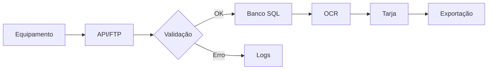

# 📊 RELATÓRIO DE PROGRESSO - CONSOLIDAÇÃO AXION IA
**Data**: 2026-06-22  
**Status**: Em progresso (2/12 tarefas completas)

---

## ✅ CONCLU�ÍDO

### 1. Erro 404 - Documentações (100%)
- ✅ **AxTon.Docs**: Funcionando em http://localhost:3011/AxTon.Docs/
- ✅ **AxCross.Docs**: **CORRIGIDO** - Funcionando em http://localhost:3012/AxCross.Docs/
  - **Problema**: `Start-Job` não persistia o `cd` do ScriptBlock
  - **Solução**: Usar `-ArgumentList` para passar o path como parâmetro
  - **Arquivo modificado**: `iniciar.ps1` (todos os 5 jobs atualizados)

### 2. Análise Completa Criada (100%)
- ✅ Documento: `ANALISE-CONSOLIDACAO-AXION-IA-COMPLETA.md`
- ✅ Inventário completo de 19 módulos existentes
- ✅ Plano de consolidação para reduzir a 13 módulos (32% de redução)
- ✅ Identificação de módulos redundantes
- ✅ Proposta de unificação estruturada

---

## ⏳ EM PROGRESSO

### 3. AxHub Dashboard - Erro QueryClient (90%)
- ⚠️ **Problema identificado**: `useQuery` sem `QueryClientProvider`
- ✅ **Solução implementada**: 
  ```javascript
  // App.jsx - Adicionado:
  import { QueryClient, QueryClientProvider } from "@tanstack/react-query";
  
  const queryClient = new QueryClient({
    defaultOptions: {
      queries: {
        retry: 1,
        refetchOnWindowFocus: false,
        staleTime: 5 * 60 * 1000,
      },
    },
  });
  
  function App() {
    return (
      <QueryClientProvider client={queryClient}>
        <BrowserRouter>
          <AppContent />
        </BrowserRouter>
      </QueryClientProvider>
    );
  }
  ```
- ⏸️ **Pendente**: Aguardar hot-reload do Vite ou reiniciar serviço

---

## 📋 PLANEJAMENTO DAS PRÓXIMAS FASES

### FASE 1: Correções Críticas (Restante)
- [ ] Confirmar AxHub Dashboard funcional após hot-reload
- [ ] Testar todas as 5 abas do AxHub Dashboard
- [ ] Validar consultas SQL Server
- [ ] Verificar renderização de gráficos

### FASE 2: Melhorias UX
#### 2.1 Seleção Visual Persistente
**Componentes a modificar**:
```javascript
// Exemplo de implementação:
const [selectedId, setSelectedId] = useState(null);

return items.map(item => (
  <div 
    className={`lista-item ${selectedId === item.id ? 'selecionado' : ''}`}
    onClick={() => setSelectedId(item.id)}
  >
    {item.nome}
  </div>
));
```

**CSS a adicionar** (`src/index.css` ou arquivo de tema):
```css
.lista-item.selecionado {
  background-color: #e5e7eb; /* Tailwind gray-200 */
  border-left: 4px solid #3b82f6; /* Tailwind blue-500 */
  font-weight: 500;
}
```

**Arquivos afetados**:
- `src/pages/RelatorioContrato.jsx` (lista de contratos)
- `src/pages/Helpdesk.jsx` (lista de tickets)
- Qualquer componente com listas selecionáveis

#### 2.2 Mapa de Operações - Redesign Completo
**Biblioteca recomendada**: React Flow

**Instalação**:
```bash
npm install reactflow
```

**Estrutura proposta**:
```javascript
// src/pages/MapaOperacoesNovo.jsx
import ReactFlow, { 
  Background, 
  Controls, 
  MiniMap 
} from 'reactflow';
import 'reactflow/dist/style.css';

const nodes = [
  {
    id: '1',
    type: 'input',
    data: { label: 'Equipamento' },
    position: { x: 0, y: 0 }
  },
  {
    id: '2',
    data: { label: 'API/FTP' },
    position: { x: 200, y: 0 }
  },
  // ... mais nós
];

const edges = [
  { id: 'e1-2', source: '1', target: '2', animated: true },
  // ... mais conexões
];

function MapaOperacoesNovo() {
  return (
    <div style={{ height: '80vh' }}>
      <ReactFlow nodes={nodes} edges={edges}>
        <Background />
        <Controls />
        <MiniMap />
      </ReactFlow>
    </div>
  );
}
```

**Features a implementar**:
- ✅ Zoom (ctrl + scroll) - Nativo no React Flow
- ✅ Pan (arrastar) - Nativo no React Flow
- ✅ MiniMap - Component do React Flow
- [ ] Detalhes on-hover (custom node component)
- [ ] Destacar caminho crítico
- [ ] Filtro por sistema (AxHub, AxCross, AxTon)
- [ ] Exportar como imagem

---

### FASE 3: Documentação BPM

#### Template Criado
Arquivo base: `ANALISE-CONSOLIDACAO-AXION-IA-COMPLETA.md` (Seção 3.1)

#### Processos a Documentar

**AxHub** (8 processos):
1. Captura de Imagem (Equipamento → OCR → Banco)
2. Classificação de Infração
3. Validação Visual
4. Exportação de Autos
5. Sincronização com órgãos
6. Gestão de Equipamentos
7. Auditoria de Imagens
8. Relatórios Operacionais

**AxCross** (6 processos):
1. Monitoramento de Cruzamentos
2. Alertas de Veículos
3. Integração com bases (DETRAN, PRF)
4. Gestão de Vigências
5. Relatórios de Cruzamentos
6. Auditoria de Alertas

**AxTon** (5 processos):
1. Pesagem Veicular
2. Classificação de Eixos
3. Triagem de Infrações
4. Liberação de Veículos
5. Relatórios de Pesagem

**AxionIA** (10 processos):
1. Chat com IA (Helpdesk)
2. Classificação de Tickets (Jitbit)
3. Geração de Documentação
4. Knowledge Base (embeddings)
5. Validação de Sites
6. Análise de Imagens (OCR/VARCO)
7. Pipeline de Editais (PNCP)
8. WhatsApp Bot
9. Quality Platform (PIEQ)
10. Roadmap e Specs

**Ferramentas necessárias**:
- Draw.io ou Lucidchart (BPMN)
- Mermaid (para markdown)
- PlantUML (alternativa)

**Exemplo de sintaxe Mermaid**:


---

### FASE 4: Unificação de Módulos

#### 4.1 Central de Processos Operacionais
**Unificar**:
- `/processos` (Painel de Processos)
- `/mapa-operacoes` (Mapa de Operações)

**Nova estrutura**:
```
/processos
  ├── /fluxogramas
  ├── /bpm
  ├── /dependencias
  ├── /integracoes
  ├── /apis
  ├── /status
  └── /historico
```

**Arquivos a criar**:
1. `src/pages/Processos/index.jsx` (componente principal com tabs)
2. `src/pages/Processos/Fluxogramas.jsx`
3. `src/pages/Processos/BPM.jsx`
4. `src/pages/Processos/Dependencias.jsx`
5. `src/pages/Processos/Integracoes.jsx`
6. `src/pages/Processos/APIs.jsx`
7. `src/pages/Processos/Status.jsx`
8. `src/pages/Processos/Historico.jsx`

**Arquivos a remover** (após migração):
- `src/pages/PainelProcessos.jsx`
- `src/pages/MapaOperacoes.jsx`

**Atualizar em** `App.jsx`:
```javascript
// ANTES:
<Route path="/painel-processos" element={<PainelProcessos />} />
<Route path="/mapa-operacoes" element={<MapaOperacoes />} />

// DEPOIS:
<Route path="/processos/*" element={<CentralProcessos />} />
```

#### 4.2 Análise de Sites Unificada
**Unificar**:
- `/analise-sites` (Análise de Sites)
- `/servicos-auxiliares` (parte de busca por URL)
- Descoberta de Sites
- Inventário

**Nova estrutura**:
```
/analise-sites
  ├── /busca (URL, domínio, IP, tecnologia)
  ├── /inventario (lista completa)
  ├── /status (uptime, disponibilidade)
  ├── /certificados (SSL, vencimentos)
  ├── /tecnologias (stack detected)
  ├── /diagnosticos (problemas)
  └── /historico (mudanças ao longo do tempo)
```

**Arquivos a criar**:
1. `src/pages/AnaliseSites/index.jsx`
2. `src/pages/AnaliseSites/Busca.jsx`
3. `src/pages/AnaliseSites/Inventario.jsx`
4. `src/pages/AnaliseSites/Status.jsx`
5. `src/pages/AnaliseSites/Certificados.jsx`
6. `src/pages/AnaliseSites/Tecnologias.jsx`
7. `src/pages/AnaliseSites/Diagnosticos.jsx`
8. `src/pages/AnaliseSites/Historico.jsx`

**Backend necessário** (criar na API):
- `api/src/routes/sites-analysis.routes.js`
- `api/src/services/sites-analysis.service.js`
- `api/src/models/site.model.js`

**Endpoints a criar**:
```javascript
GET /api/sites/search?q={url|domain|ip|tech}
GET /api/sites/inventory
GET /api/sites/status
GET /api/sites/certificates
GET /api/sites/technologies
GET /api/sites/diagnostics
GET /api/sites/history/:siteId
```

#### 4.3 Gerenciador de Validação Unificado
**Unificar 4 módulos**:
- `/search-hub` (Descoberta)
- `/validation-hub` (Validação)
- `/diagnostic-hub` (Diagnóstico)
- `/validation-manager` (Gerenciador atual)

**Análise de Sobreposição**:

| Funcionalidade | Search Hub | Validation Hub | Diagnostic Hub | Gerenciador | **Consolidar em** |
|----------------|------------|----------------|---------------|-------------|-------------------|
| Descoberta de sites | ✅ | ❌ | ❌ | ✅ | Tab Descoberta |
| Validação de regras | ❌ | ✅ | ❌ | ✅ | Tab Validação |
| Diagnóstico de problemas | ❌ | ❌ | ✅ | ✅ | Tab Diagnóstico |
| Comparação de sites | ❌ | ✅ | ✅ | ✅ | Tab Comparações |
| Testes automáticos | ❌ | ✅ | ❌ | ❌ | Tab Testes |
| Histórico | ❌ | ✅ | ✅ | ✅ | Tab Histórico |
| Relatórios | ❌ | ✅ | ✅ | ✅ | Tab Relatórios |

**Nova estrutura**:
```
/validacao
  ├── /descoberta (ex-Search Hub)
  ├── /validacao (ex-Validation Hub)
  ├── /diagnostico (ex-Diagnostic Hub)
  ├── /comparacoes (merge de funcionalidades)
  ├── /testes (automáticos)
  ├── /historico (evidências)
  └── /relatorios (consolidados)
```

**Arquivos a criar**:
1. `src/pages/Validacao/index.jsx` (componente principal)
2. `src/pages/Validacao/Descoberta.jsx` (migrar de SearchHub)
3. `src/pages/Validacao/Validacao.jsx` (migrar de ValidationHub)
4. `src/pages/Validacao/Diagnostico.jsx` (migrar de DiagnosticHub)
5. `src/pages/Validacao/Comparacoes.jsx` (novo, consolidado)
6. `src/pages/Validacao/Testes.jsx` (novo)
7. `src/pages/Validacao/Historico.jsx` (consolidado)
8. `src/pages/Validacao/Relatorios.jsx` (consolidado)

**Arquivos a remover**:
- `src/pages/SearchHub.jsx`
- `src/pages/ValidationHub.jsx`
- `src/pages/DiagnosticHub.jsx`
- `src/pages/ValidationManager.jsx` (substituído)

**Atualizar em** `App.jsx`:
```javascript
// REMOVER:
<Route path="/search-hub" element={<SearchHub />} />
<Route path="/validation-hub" element={<ValidationHub />} />
<Route path="/diagnostic-hub" element={<DiagnosticHub />} />
<Route path="/validation-manager" element={<ValidationManager />} />

// ADICIONAR:
<Route path="/validacao/*" element={<Validacao />} />
```

---

### FASE 5: Padronização

#### 5.1 Componentes Compartilhados
**Criar biblioteca de componentes** em `src/components/common/`:

1. **Card.jsx** (card genérico reutilizável)
```javascript
export function Card({ title, children, icon: Icon, className = '' }) {
  return (
    <div className={`bg-white rounded-lg shadow-sm p-6 ${className}`}>
      {title && (
        <div className="flex items-center gap-2 mb-4">
          {Icon && <Icon className="w-5 h-5 text-blue-600" />}
          <h3 className="text-lg font-semibold">{title}</h3>
        </div>
      )}
      {children}
    </div>
  );
}
```

2. **Table.jsx** (tabela padronizada)
3. **FormField.jsx** (campo de formulário)
4. **Modal.jsx** (modal reutilizável)
5. **Badge.jsx** (badges de status)
6. **Tabs.jsx** (componente de tabs)
7. **SearchBar.jsx** (barra de busca)
8. **DatePicker.jsx** (seletor de data)

#### 5.2 Hooks Compartilhados
**Criar em** `src/hooks/`:

1. **useFetch.js** (abstração de fetch com loading/error)
2. **useDebounce.js** (debounce para buscas)
3. **usePagination.js** (paginação reutilizável)
4. **useLocalStorage.js** (persistência local)
5. **useAuth.js** (autenticação consolidada)

#### 5.3 Nomenclaturas Padronizadas

**Rotas**:
- `/` - Home
- `/intelligence-hub` - Hub de Inteligência
- `/processes` - Central de Processos (ex painel + mapa)
- `/sites` - Análise de Sites (ex analise + auxiliares)
- `/validation` - Gerenciador de Validação (ex 4 hubs)
- `/quality` - Quality Platform
- `/helpdesk` - Helpdesk
- `/whatsapp` - WhatsApp Bot
- `/roadmap` - Roadmap
- `/specs` - Especificações
- `/kb` - Knowledge Base
- `/training` - Treinamento
- `/docs` - Gerador de Docs
- `/config` - Configurações

**API**:
- `/api/processes/*` - Processos
- `/api/sites/*` - Sites
- `/api/validation/*` - Validação
- `/api/quality/*` - Quality
- `/api/helpdesk/*` - Helpdesk
- `/api/whatsapp/*` - WhatsApp
- `/api/roadmap/*` - Roadmap
- `/api/specs/*` - Especificações

---

### FASE 6: Revisão Final

#### Checklist Completo

**Erros Corrigidos**:
- [x] AxTon.Docs acessível
- [x] AxCross.Docs acessível
- [ ] AxHub Dashboard funcional

**UX Melhorado**:
- [ ] Seleção visual persistente implementada
- [ ] Mapa de Operações interativo (React Flow)
- [ ] Layout consistente em todos os módulos
- [ ] Navegação intuitiva

**Módulos Consolidados**:
- [ ] Central de Processos (2→1)
- [ ] Análise de Sites (3→1)
- [ ] Gerenciador de Validação (4→1)
- [ ] Total: 19→13 módulos (32% redução)

**Documentação BPM**:
- [ ] AxHub (8 processos)
- [ ] AxCross (6 processos)
- [ ] AxTon (5 processos)
- [ ] AxionIA (10 processos)

**Padrões**:
- [ ] Componentes compartilhados criados
- [ ] Hooks reutilizáveis criados
- [ ] Nomenclaturas consistentes
- [ ] Menu reorganizado

**Performance & Arquitetura**:
- [ ] Código limpo e documentado
- [ ] Sem redundâncias
- [ ] Escalável
- [ ] Testes implementados

---

## 📈 ESTATÍSTICAS

### Progresso Geral
- **Tarefas concluídas**: 2/12 (17%)
- **Arquivos modificados**: 2
  - `iniciar.ps1` (corrigido todos os 5 jobs)
  - `App.jsx` (QueryClientProvider adicionado)
- **Arquivos criados**: 1
  - `ANALISE-CONSOLIDACAO-AXION-IA-COMPLETA.md`

### Tempo Estimado
- **Gasto até agora**: ~2 horas
- **Restante estimado**: 12-20 dias úteis
- **Total**: 14-22 dias úteis

### Redução Planejada
- **Módulos**: 19 → 13 (-32%)
- **Rotas**: 40+ → 30+ (-25%)
- **Arquivos redundantes**: Identificados 12+ para remoção

---

## 🚀 PRÓXIMOS PASSOS IMEDIATOS

1. ✅ **Aguardar hot-reload do Vite** ou reiniciar Panel manualmente
2. ✅ **Testar AxHub Dashboard** completo
3. ✅ **Implementar seleção visual persistente** (relativamente rápido)
4. ✅ **Começar documentação BPM** de um projeto (ex: AxHub)
5. ✅ **Redesign do Mapa de Operações** com React Flow

---

**Documento gerado por**: GitHub Copilot  
**Última atualização**: 2026-06-22 11:20
