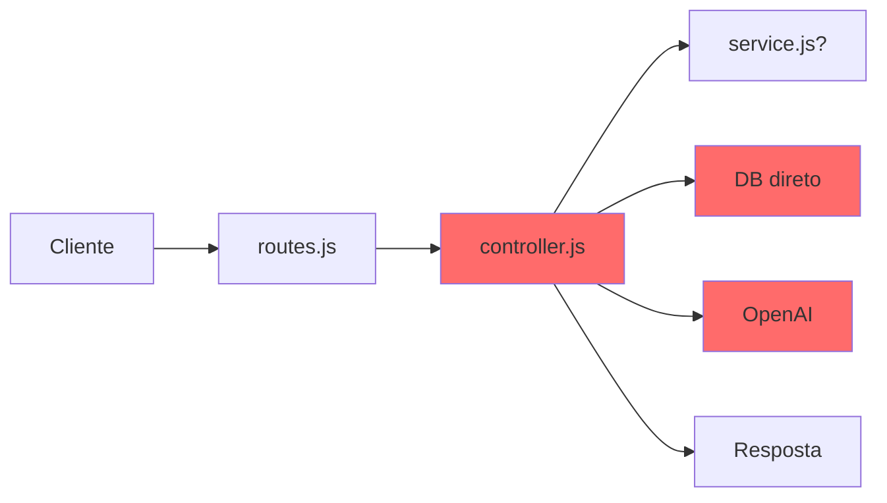
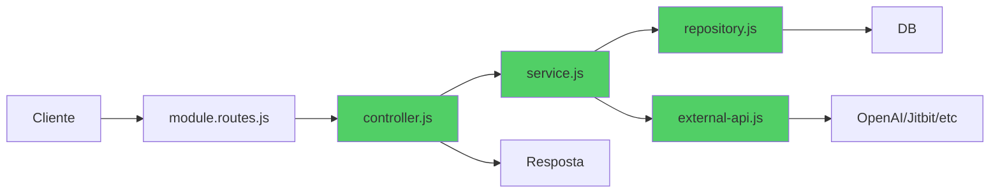

# UNIFIED - ARQUITETURA E PLANEJAMENTO

**Data de Consolidacao:** 2026-06-20  
**Arquivos consolidados:** 3

---

---

## ORIGEM: PLANO-ORGANIZACIONAL-UNIFICACAO.md

# 🏗️ Plano Organizacional - Unificação Completa do Ecossistema

**Axion Intelligence Platform**  
**Data:** 2026-06-20  
**Objetivo:** Unificar toda a estrutura em um único local centralizado

---

## 🎯 VISÃO GERAL

### **Situação Atual: Fragmentada**

```
❌ PROBLEMA: Dados espalhados em múltiplos locais

Axion.Docs/
├── 📁 AxHub/               ← Documentação AxHub
│   ├── docs-portal/
│   ├── Database/
│   └── widget/
├── 📁 AxTon/               ← Documentação AxTon
│   ├── docs-portal/
│   ├── Database/
│   └── widget/
├── 📁 AxCross/             ← Documentação AxCross
│   ├── docs-portal/
│   ├── Database/
│   └── widget/
├── 📁 axion-ia-api/        ← Backend API
│   ├── src/
│   ├── uploads/
│   └── reports/
├── 📁 axion-ia-panel/      ← Frontend React
│   ├── src/
│   └── dist/
├── 📁 docs-portal/         ← Portal unificado (legacy)
├── 📄 100+ arquivos .md na raiz (análises, relatórios, guias)
├── 📄 Scripts .ps1 e .mjs espalhados
├── 📄 Dados .json e .csv espalhados
└── 📄 PDFs e vídeos na raiz

Problemas:
❌ Dificuldade de encontrar arquivos
❌ Duplicação de estruturas (3x docs-portal)
❌ Backup complexo (múltiplos locais)
❌ Relacionamento entre processos não está claro
❌ Mesmas funcionalidades duplicadas
```

---

### **Visão Futura: Unificada**

```
✅ SOLUÇÃO: Estrutura única e centralizada

Axion-Unified/
├── 📂 core/                    ← CORE: Aplicações principais
│   ├── api/                    ← Backend (axion-ia-api)
│   ├── panel/                  ← Frontend (axion-ia-panel)
│   └── shared/                 ← Código compartilhado
│
├── 📂 products/                ← PRODUTOS: Sistemas Axion
│   ├── axhub/
│   ├── axton/
│   └── axcross/
│
├── 📂 docs/                    ← DOCUMENTAÇÃO: Única e centralizada
│   ├── portals/                ← Portais Docusaurus
│   ├── guides/                 ← Guias e manuais
│   ├── analysis/               ← Análises técnicas
│   └── references/             ← Referências e specs
│
├── 📂 data/                    ← DADOS: Base única
│   ├── databases/              ← SQL schemas
│   ├── knowledge-base/         ← KB unificada
│   ├── uploads/                ← Arquivos enviados
│   └── exports/                ← Relatórios gerados
│
├── 📂 tools/                   ← FERRAMENTAS: Scripts e utilitários
│   ├── scripts/                ← Scripts PowerShell/Node
│   ├── automation/             ← Automações
│   └── migration/              ← Scripts de migração
│
├── 📂 resources/               ← RECURSOS: Assets e mídia
│   ├── media/                  ← Vídeos e imagens
│   ├── pdfs/                   ← Documentos PDF
│   └── templates/              ← Templates
│
└── 📂 config/                  ← CONFIGURAÇÃO: Configs centralizadas
    ├── environments/
    ├── deployments/
    └── backups/

Benefícios:
✅ Estrutura lógica e intuitiva
✅ Fácil localização de arquivos
✅ Backup simplificado (1 pasta raiz)
✅ Relacionamentos claros
✅ Processos unificados
```

---

## 📋 TAXONOMIA DE PROCESSOS

### **Critérios de Classificação**

#### **1. 🔍 INVESTIGADORES (Validators)**
**Definição:** Processos que investigam, auditam e validam dados/sistemas

**Características:**
- Verificam conformidade
- Identificam anomalias
- Geram relatórios de auditoria
- Não modificam dados (apenas lêem)

**Processos Identificados:**
```
modules/investigators/
├── validation-manager/      ← Validação de sistemas web
├── visual-validator/         ← Validação visual de UI
├── varco-monitor/           ← Monitor de câmeras VARCO
├── alert-flow-validator/    ← Validação de fluxo de alertas
└── duplicity-auditor/       ← Auditoria de duplicidades

Métricas:
- 5 investigadores
- 28 endpoints
- Lógica: read-only
- Output: Relatórios de conformidade
```

---

#### **2. 📊 ANALISADORES (Analyzers)**
**Definição:** Processos que processam dados e geram insights

**Características:**
- Processam grandes volumes de dados
- Aplicam algoritmos complexos
- Geram análises e métricas
- Podem usar IA/ML

**Processos Identificados:**
```
modules/analyzers/
├── measurement-analyzer/    ← Análise de medições
├── image-analyzer/          ← Análise de imagens (OCR)
├── compliance-analyzer/     ← Análise de conformidade
├── tender-analyzer/         ← Análise de editais
└── strategic-reader/        ← Leitura estratégica 80/20

Métricas:
- 5 analisadores
- 40 endpoints
- Lógica: processamento intensivo
- Output: Insights e métricas
```

---

#### **3. 📄 GERADORES DE RELATÓRIOS (Reporters)**
**Definição:** Processos que compilam dados em relatórios formatados

**Características:**
- Agregam dados de múltiplas fontes
- Formatam em layouts específicos
- Exportam em diversos formatos
- Focados em apresentação

**Processos Identificados:**
```
modules/reporters/
├── contract-reporter/       ← Relatórios por contrato
├── flow-reporter/           ← Relatórios de fluxo
├── hours-reporter/          ← Planilha de horas
└── sla-reporter/            ← Relatório de SLA

Métricas:
- 4 geradores
- 11 endpoints
- Lógica: compilação e formatação
- Output: Relatórios prontos (PDF/Excel/CSV)
```

---

#### **4. 🤖 PROCESSADORES IA (AI Processors)**
**Definição:** Processos que utilizam inteligência artificial

**Características:**
- Usam modelos de linguagem (OpenAI)
- Processamento de linguagem natural
- Embeddings e classificação
- Aprendizado e treinamento

**Processos Identificados:**
```
modules/ai-processors/
├── chat-assistant/          ← Assistente de chat
├── agent-orchestrator/      ← Orquestrador de agentes
├── helpdesk-ai/            ← IA para helpdesk
├── confidence-manager/      ← Gerenciador de confiança
└── classifier/              ← Classificador de intenções

Core IA:
├── engine/                  ← Motor de IA
├── embeddings/              ← Geração de embeddings
└── training/                ← Sistema de treinamento

Métricas:
- 5 processadores
- 36 endpoints
- Lógica: IA/ML
- Output: Respostas inteligentes
```

---

#### **5. 🏭 GERADORES (Generators)**
**Definição:** Processos que criam artefatos (docs, specs, roadmaps)

**Características:**
- Criam documentos estruturados
- Seguem templates
- Geram código ou markdown
- Automatizam criação de artefatos

**Processos Identificados:**
```
modules/generators/
├── doc-generator/           ← Gerador de documentação
├── roadmap-generator/       ← Gerador de roadmaps
└── spec-generator/          ← Gerador de especificações

Métricas:
- 3 geradores
- 13 endpoints
- Lógica: criação de artefatos
- Output: Documentos/Specs/Roadmaps
```

---

#### **6. 🔌 CONECTORES (Connectors)**
**Definição:** Processos que integram sistemas externos

**Características:**
- Conectam com APIs/Databases externas
- Sincronizam dados
- Não processam, apenas transportam
- Gerenciam conexões

**Processos Identificados:**
```
modules/connectors/
├── axhub-connector/         ← Integração AxHub SQL Server
├── axton-connector/         ← Integração AxTon SQL Server
├── axcross-connector/       ← Integração AxCross SQL Server
├── whatsapp-connector/      ← Integração WhatsApp
├── jitbit-connector/        ← Integração Jitbit Helpdesk
└── pncp-connector/          ← Integração PNCP (gov)

Métricas:
- 6 conectores
- 56 endpoints
- Lógica: transporte de dados
- Output: Dados sincronizados
```

---

#### **7. 📚 REPOSITÓRIOS (Repositories)**
**Definição:** Processos que armazenam e recuperam dados estruturados

**Características:**
- CRUD de entidades
- Persistência de dados
- Consultas estruturadas
- Gerenciamento de estado

**Processos Identificados:**
```
modules/repositories/
├── knowledge-base/          ← Base de conhecimento
├── sources-registry/        ← Registro de fontes
└── crm-repository/          ← CRM (contatos/clientes/equipamentos)

Métricas:
- 3 repositórios
- 32 endpoints
- Lógica: CRUD
- Output: Entidades persistidas
```

---

#### **8. ⚙️ SERVIÇOS DE SISTEMA (System Services)**
**Definição:** Processos de infraestrutura e suporte

**Características:**
- Configuração
- Monitoramento
- Logs e auditoria
- Upload de arquivos

**Processos Identificados:**
```
modules/system-services/
├── configuration/           ← Gerenciamento de config
├── health-monitor/          ← Health checks
├── log-manager/             ← Gerenciamento de logs
└── upload-service/          ← Upload de arquivos

Métricas:
- 4 serviços
- 9 endpoints
- Lógica: infraestrutura
- Output: Operações de sistema
```

---

## 🔗 MATRIZ DE RELACIONAMENTOS

### **Mapa de Dependências entre Processos**

```
┌─────────────────────────────────────────────────────────────┐
│                    CAMADA DE APRESENTAÇÃO                    │
│                   axion-ia-panel (React)                     │
└────────────────────┬────────────────────────────────────────┘
                     │
                     ↓
┌─────────────────────────────────────────────────────────────┐
│                     CAMADA DE API                            │
│                  axion-ia-api (Express)                      │
└──┬──────┬──────┬──────┬──────┬──────┬──────┬──────┬────────┘
   │      │      │      │      │      │      │      │
   ↓      ↓      ↓      ↓      ↓      ↓      ↓      ↓
┌─────┐┌─────┐┌─────┐┌─────┐┌─────┐┌─────┐┌─────┐┌─────┐
│ 🔍  ││ 📊  ││ 📄  ││ 🤖  ││ 🏭  ││ 🔌  ││ 📚  ││ ⚙️  │
│INVES││ANALY││REPOR││AI   ││GENER││CONEC││REPOS││SYST │
│TIGA ││ZERS ││TERS ││PROC ││ATORS││TORS ││ITOR ││SERV │
│DORES││     ││     ││     ││     ││     ││IES  ││ICES │
└─────┘└─────┘└─────┘└──┬──┘└─────┘└──┬──┘└─────┘└─────┘
                         │              │
                         ↓              ↓
                    ┌─────────┐   ┌─────────┐
                    │ OpenAI  │   │External │
                    │   API   │   │ Systems │
                    └─────────┘   └─────────┘
                         ↑              ↑
                         │              │
                         └──────┬───────┘
                                │
                         ┌──────┴───────┐
                         │  DATA LAYER  │
                         │ MongoDB      │
                         │ SQL Server   │
                         └──────────────┘
```

---

### **Relacionamentos Funcionais**

#### **Investigadores → Analisadores**
```
VARCO Monitor ──[envia dados]──→ Measurement Analyzer
                                   │
                                   ↓
                              [processa métricas]
                                   │
                                   ↓
Duplicity Auditor ←──[recebe insights]──┘
```

#### **Analisadores → Geradores de Relatórios**
```
Measurement Analyzer ─────┐
Image Analyzer ───────────┤
Compliance Analyzer ──────┼──→ Contract Reporter → [PDF]
Tender Analyzer ──────────┤
Strategic Reader ─────────┘
```

#### **AI Processors → Todos**
```
Chat Assistant ──[usa]──→ Knowledge Base
                          │
Agent Orchestrator ──[orquestra]──→ Todos os módulos
                          │
Helpdesk AI ──[usa]──→ Jitbit Connector
                          │
Confidence Manager ──[alimenta]──→ Todos os Analisadores
```

#### **Conectores → Repositórios**
```
AxHub Connector ────┐
AxTon Connector ────┼──→ CRM Repository → [MongoDB]
AxCross Connector ──┘
```

---

## 🏗️ ESTRUTURA UNIFICADA PROPOSTA

### **Estrutura Completa**

```
C:/Projects/Axion-Unified/
│
├── 📂 core/                              ← APLICAÇÕES PRINCIPAIS
│   ├── api/                              ← Backend (ex: axion-ia-api)
│   │   ├── src/
│   │   │   ├── modules/                  ← Módulos organizados
│   │   │   │   ├── investigators/        ← 🔍 Investigadores
│   │   │   │   │   ├── validation-manager/
│   │   │   │   │   ├── visual-validator/
│   │   │   │   │   ├── varco-monitor/
│   │   │   │   │   ├── alert-flow-validator/
│   │   │   │   │   └── duplicity-auditor/
│   │   │   │   │
│   │   │   │   ├── analyzers/            ← 📊 Analisadores
│   │   │   │   │   ├── measurement-analyzer/
│   │   │   │   │   ├── image-analyzer/
│   │   │   │   │   ├── compliance-analyzer/
│   │   │   │   │   ├── tender-analyzer/
│   │   │   │   │   └── strategic-reader/
│   │   │   │   │
│   │   │   │   ├── reporters/            ← 📄 Geradores de Relatórios
│   │   │   │   │   ├── contract-reporter/
│   │   │   │   │   ├── flow-reporter/
│   │   │   │   │   ├── hours-reporter/
│   │   │   │   │   └── sla-reporter/
│   │   │   │   │
│   │   │   │   ├── ai-processors/        ← 🤖 Processadores IA
│   │   │   │   │   ├── chat-assistant/
│   │   │   │   │   ├── agent-orchestrator/
│   │   │   │   │   ├── helpdesk-ai/
│   │   │   │   │   ├── confidence-manager/
│   │   │   │   │   ├── classifier/
│   │   │   │   │   └── core/             ← Motor IA
│   │   │   │   │       ├── engine.js
│   │   │   │   │       ├── embeddings/
│   │   │   │   │       └── training/
│   │   │   │   │
│   │   │   │   ├── generators/           ← 🏭 Geradores
│   │   │   │   │   ├── doc-generator/
│   │   │   │   │   ├── roadmap-generator/
│   │   │   │   │   └── spec-generator/
│   │   │   │   │
│   │   │   │   ├── connectors/           ← 🔌 Conectores
│   │   │   │   │   ├── axhub-connector/
│   │   │   │   │   ├── axton-connector/
│   │   │   │   │   ├── axcross-connector/
│   │   │   │   │   ├── whatsapp-connector/
│   │   │   │   │   ├── jitbit-connector/
│   │   │   │   │   └── pncp-connector/
│   │   │   │   │
│   │   │   │   ├── repositories/         ← 📚 Repositórios
│   │   │   │   │   ├── knowledge-base/
│   │   │   │   │   ├── sources-registry/
│   │   │   │   │   └── crm-repository/
│   │   │   │   │
│   │   │   │   └── system-services/      ← ⚙️ Serviços de Sistema
│   │   │   │       ├── configuration/
│   │   │   │       ├── health-monitor/
│   │   │   │       ├── log-manager/
│   │   │   │       └── upload-service/
│   │   │   │
│   │   │   ├── shared/                   ← Código compartilhado
│   │   │   │   ├── middleware/
│   │   │   │   ├── utils/
│   │   │   │   ├── constants/
│   │   │   │   └── types/
│   │   │   │
│   │   │   ├── database/                 ← Camada de dados
│   │   │   │   ├── mongodb/
│   │   │   │   └── mssql/
│   │   │   │
│   │   │   ├── routes.js
│   │   │   └── app.js
│   │   │
│   │   ├── tests/                        ← Testes
│   │   │   ├── unit/
│   │   │   ├── integration/
│   │   │   └── e2e/
│   │   │
│   │   ├── package.json
│   │   └── README.md
│   │
│   ├── panel/                            ← Frontend (ex: axion-ia-panel)
│   │   ├── src/
│   │   │   ├── pages/
│   │   │   ├── components/
│   │   │   ├── services/
│   │   │   └── App.jsx
│   │   ├── public/
│   │   ├── package.json
│   │   └── README.md
│   │
│   └── shared/                           ← Compartilhado entre API/Panel
│       ├── types/
│       ├── constants/
│       └── utils/
│
├── 📂 products/                          ← PRODUTOS AXION
│   ├── axhub/
│   │   ├── docs/                         ← Docs específicos do produto
│   │   ├── database/                     ← Schema SQL
│   │   │   └── AxHub.sql
│   │   ├── widgets/                      ← Widgets específicos
│   │   └── README.md
│   │
│   ├── axton/
│   │   ├── docs/
│   │   ├── database/
│   │   │   └── AxTon.sql
│   │   ├── widgets/
│   │   └── README.md
│   │
│   └── axcross/
│       ├── docs/
│       ├── database/
│       │   └── AxCross.sql
│       ├── widgets/
│       └── README.md
│
├── 📂 docs/                              ← DOCUMENTAÇÃO UNIFICADA
│   │
│   ├── portals/                          ← Portais Docusaurus
│   │   ├── axhub-portal/
│   │   │   ├── docs/
│   │   │   ├── docusaurus.config.ts
│   │   │   └── sidebars.ts
│   │   ├── axton-portal/
│   │   └── axcross-portal/
│   │
│   ├── guides/                           ← Guias e manuais
│   │   ├── user-guides/
│   │   │   ├── axhub/
│   │   │   ├── axton/
│   │   │   └── axcross/
│   │   ├── admin-guides/
│   │   ├── developer-guides/
│   │   └── troubleshooting/
│   │
│   ├── analysis/                         ← Análises técnicas
│   │   ├── business-analysis/
│   │   │   ├── mercado/
│   │   │   ├── estrategia/
│   │   │   └── comercial/
│   │   ├── technical-analysis/
│   │   │   ├── diagnosticos/
│   │   │   ├── validacoes/
│   │   │   └── comparativos/
│   │   └── operational-analysis/
│   │       ├── medicao/
│   │       ├── heartbeat/
│   │       └── performance/
│   │
│   └── references/                       ← Referências técnicas
│       ├── api/
│       │   └── openapi.json
│       ├── architecture/
│       │   ├── MAPEAMENTO-FUNCIONALIDADES.md
│       │   ├── DIAGRAMA-ARQUITETURA.md
│       │   └── PLANO-ORGANIZACIONAL.md
│       ├── specs/
│       └── roadmaps/
│
├── 📂 data/                              ← BASE ÚNICA DE DADOS
│   │
│   ├── databases/                        ← Schemas SQL
│   │   ├── axhub/
│   │   │   ├── schema.sql
│   │   │   └── migrations/
│   │   ├── axton/
│   │   └── axcross/
│   │
│   ├── knowledge-base/                   ← KB unificada
│   │   ├── embeddings/
│   │   ├── training-data/
│   │   └── kb.json
│   │
│   ├── uploads/                          ← Arquivos enviados
│   │   ├── images/
│   │   │   ├── axhub/
│   │   │   ├── axton/
│   │   │   └── axcross/
│   │   ├── documents/
│   │   └── contexts/
│   │
│   ├── exports/                          ← Relatórios gerados
│   │   ├── reports/
│   │   │   ├── contracts/
│   │   │   ├── flows/
│   │   │   └── hours/
│   │   ├── logs/
│   │   └── screenshots/
│   │
│   └── cache/                            ← Cache de dados
│       └── temp/
│
├── 📂 tools/                             ← FERRAMENTAS E SCRIPTS
│   │
│   ├── scripts/                          ← Scripts de utilidades
│   │   ├── powershell/
│   │   │   ├── iniciar.ps1
│   │   │   ├── encerrar.ps1
│   │   │   ├── gerar-pdf.ps1
│   │   │   └── backup.ps1
│   │   └── node/
│   │       ├── gerar-kb.mjs
│   │       ├── analisar-equipamentos.mjs
│   │       └── validar-credenciais.mjs
│   │
│   ├── automation/                       ← Automações
│   │   ├── ci-cd/
│   │   ├── deploy/
│   │   └── monitoring/
│   │
│   └── migration/                        ← Scripts de migração
│       ├── migrate-to-unified.ps1
│       ├── consolidate-docs.ps1
│       └── merge-databases.ps1
│
├── 📂 resources/                         ← RECURSOS E MÍDIA
│   │
│   ├── media/                            ← Vídeos e imagens
│   │   ├── videos/
│   │   │   ├── axton-apresentacao.mp4
│   │   │   └── axton-narrado.mp4
│   │   └── images/
│   │       └── logos/
│   │
│   ├── pdfs/                             ← Documentos PDF
│   │   ├── manuais/
│   │   │   ├── Manual-AxHub-v1.0.0.pdf
│   │   │   ├── Manual-AxTon-v1.0.0.pdf
│   │   │   └── Manual-AxCross-v1.0.0.pdf
│   │   └── apresentacoes/
│   │
│   └── templates/                        ← Templates
│       ├── word/
│       ├── excel/
│       └── powerpoint/
│
├── 📂 config/                            ← CONFIGURAÇÕES
│   │
│   ├── environments/                     ← Configs por ambiente
│   │   ├── .env.development
│   │   ├── .env.staging
│   │   └── .env.production
│   │
│   ├── deployments/                      ← Configurações de deploy
│   │   ├── docker-compose.yml
│   │   └── kubernetes/
│   │
│   └── backups/                          ← Estratégia de backup
│       ├── backup-config.json
│       └── restore-procedures.md
│
├── 📄 README.md                          ← Documentação principal
├── 📄 CHANGELOG.md
├── 📄 LICENSE
└── 📄 .gitignore
```

---

## 📊 PLANO DE UNIFICAÇÃO

### **Fase 1: Preparação (2 dias)**

#### **Dia 1: Criar Estrutura**

**Checklist:**
- [ ] Criar pasta raiz `Axion-Unified/`
- [ ] Criar estrutura completa de pastas
- [ ] Criar README.md em cada pasta principal
- [ ] Configurar Git na nova estrutura

**Script de Criação:**

```powershell
# tools/migration/01-create-unified-structure.ps1

$root = "C:\Projects\Axion-Unified"

Write-Host "🏗️  Criando estrutura unificada..." -ForegroundColor Cyan

# Core
$coreDirs = @(
    "core\api\src\modules\investigators",
    "core\api\src\modules\analyzers",
    "core\api\src\modules\reporters",
    "core\api\src\modules\ai-processors\core",
    "core\api\src\modules\generators",
    "core\api\src\modules\connectors",
    "core\api\src\modules\repositories",
    "core\api\src\modules\system-services",
    "core\api\src\shared",
    "core\api\src\database\mongodb",
    "core\api\src\database\mssql",
    "core\api\tests",
    "core\panel\src",
    "core\shared"
)

# Products
$productDirs = @(
    "products\axhub\docs",
    "products\axhub\database",
    "products\axhub\widgets",
    "products\axton\docs",
    "products\axton\database",
    "products\axton\widgets",
    "products\axcross\docs",
    "products\axcross\database",
    "products\axcross\widgets"
)

# Docs
$docsDirs = @(
    "docs\portals\axhub-portal",
    "docs\portals\axton-portal",
    "docs\portals\axcross-portal",
    "docs\guides\user-guides",
    "docs\guides\admin-guides",
    "docs\guides\developer-guides",
    "docs\analysis\business-analysis",
    "docs\analysis\technical-analysis",
    "docs\analysis\operational-analysis",
    "docs\references\api",
    "docs\references\architecture",
    "docs\references\specs"
)

# Data
$dataDirs = @(
    "data\databases\axhub",
    "data\databases\axton",
    "data\databases\axcross",
    "data\knowledge-base\embeddings",
    "data\uploads\images",
    "data\uploads\documents",
    "data\exports\reports",
    "data\exports\logs",
    "data\cache"
)

# Tools
$toolsDirs = @(
    "tools\scripts\powershell",
    "tools\scripts\node",
    "tools\automation",
    "tools\migration"
)

# Resources
$resourcesDirs = @(
    "resources\media\videos",
    "resources\media\images",
    "resources\pdfs\manuais",
    "resources\templates"
)

# Config
$configDirs = @(
    "config\environments",
    "config\deployments",
    "config\backups"
)

$allDirs = $coreDirs + $productDirs + $docsDirs + $dataDirs + $toolsDirs + $resourcesDirs + $configDirs

foreach ($dir in $allDirs) {
    $fullPath = Join-Path $root $dir
    New-Item -Path $fullPath -ItemType Directory -Force | Out-Null
    Write-Host "✅ Criado: $dir" -ForegroundColor Green
}

Write-Host "`n✅ Estrutura criada com sucesso!" -ForegroundColor Green
Write-Host "📂 Local: $root" -ForegroundColor Cyan
```

---

#### **Dia 2: Mapear Arquivos**

**Criar mapa de migração:**

```powershell
# tools/migration/02-map-files.ps1

$source = "C:\Users\Santiago\Axiondocs\Axion.Docs"
$target = "C:\Projects\Axion-Unified"

# Criar arquivo de mapeamento
$mapFile = "$target\tools\migration\migration-map.json"

$map = @{
    # Core API
    "axion-ia-api\src" = "core\api\src"
    "axion-ia-api\package.json" = "core\api\package.json"
    
    # Core Panel
    "axion-ia-panel\src" = "core\panel\src"
    "axion-ia-panel\package.json" = "core\panel\package.json"
    
    # Products
    "AxHub\Database\AxHub.sql" = "products\axhub\database\schema.sql"
    "AxTon\Database" = "products\axton\database"
    "AxCross\Database\AxCross.sql" = "products\axcross\database\schema.sql"
    
    # Docs Portals
    "AxHub\docs-portal" = "docs\portals\axhub-portal"
    "AxTon\docs-portal" = "docs\portals\axton-portal"
    "AxCross\docs-portal" = "docs\portals\axcross-portal"
    
    # Análises
    "ANALISE-*.md" = "docs\analysis\technical-analysis"
    "DIAGNOSTICO-*.md" = "docs\analysis\operational-analysis"
    "VALIDACAO-*.md" = "docs\analysis\technical-analysis"
    
    # Guias
    "GUIA-*.md" = "docs\guides\user-guides"
    "MANUAL-*.md" = "docs\guides\user-guides"
    
    # Scripts
    "*.ps1" = "tools\scripts\powershell"
    "*.mjs" = "tools\scripts\node"
    "*.cjs" = "tools\scripts\node"
    
    # Recursos
    "*.mp4" = "resources\media\videos"
    "*.pdf" = "resources\pdfs\manuais"
    
    # Data
    "axion-ia-api\uploads" = "data\uploads"
    "axion-ia-api\reports" = "data\exports\reports"
    "axion-ia-api\logs" = "data\exports\logs"
}

$map | ConvertTo-Json -Depth 10 | Out-File $mapFile -Encoding UTF8

Write-Host "✅ Mapa de migração criado: $mapFile" -ForegroundColor Green
```

---

### **Fase 2: Migração de Código (3-5 dias)**

#### **Ordem de Migração:**

```
1. Core API (3 dias)
   ├── Dia 1: Estrutura modular + shared
   ├── Dia 2: Módulos (investigators, analyzers, reporters)
   └── Dia 3: Módulos (ai-processors, generators, connectors)

2. Core Panel (1 dia)
   └── Dia 1: Migrar src/ completo

3. Products (1 dia)
   └── Dia 1: Databases + docs específicos
```

**Script de Migração de Código:**

```powershell
# tools/migration/03-migrate-code.ps1

param(
    [string]$Source = "C:\Users\Santiago\Axiondocs\Axion.Docs",
    [string]$Target = "C:\Projects\Axion-Unified"
)

function Migrate-API {
    Write-Host "🔄 Migrando API..." -ForegroundColor Cyan
    
    # Copiar src/
    Copy-Item "$Source\axion-ia-api\src\*" "$Target\core\api\src\" -Recurse -Force
    
    # Copiar package.json
    Copy-Item "$Source\axion-ia-api\package.json" "$Target\core\api\" -Force
    
    # Copiar .env.example
    Copy-Item "$Source\axion-ia-api\.env.example" "$Target\core\api\" -Force
    
    Write-Host "✅ API migrada" -ForegroundColor Green
}

function Migrate-Panel {
    Write-Host "🔄 Migrando Panel..." -ForegroundColor Cyan
    
    Copy-Item "$Source\axion-ia-panel\src\*" "$Target\core\panel\src\" -Recurse -Force
    Copy-Item "$Source\axion-ia-panel\package.json" "$Target\core\panel\" -Force
    Copy-Item "$Source\axion-ia-panel\vite.config.js" "$Target\core\panel\" -Force
    
    Write-Host "✅ Panel migrado" -ForegroundColor Green
}

function Migrate-Products {
    Write-Host "🔄 Migrando Products..." -ForegroundColor Cyan
    
    # AxHub
    Copy-Item "$Source\AxHub\Database\AxHub.sql" "$Target\products\axhub\database\schema.sql" -Force
    
    # AxTon
    Copy-Item "$Source\AxTon\Database\*" "$Target\products\axton\database\" -Recurse -Force
    
    # AxCross
    Copy-Item "$Source\AxCross\Database\AxCross.sql" "$Target\products\axcross\database\schema.sql" -Force
    
    Write-Host "✅ Products migrados" -ForegroundColor Green
}

# Executar migrações
Migrate-API
Migrate-Panel
Migrate-Products

Write-Host "`n✅ Migração de código concluída!" -ForegroundColor Green
```

---

### **Fase 3: Migração de Documentação (2 dias)**

**Script de Migração de Docs:**

```powershell
# tools/migration/04-migrate-docs.ps1

param(
    [string]$Source = "C:\Users\Santiago\Axiondocs\Axion.Docs",
    [string]$Target = "C:\Projects\Axion-Unified"
)

function Migrate-Portals {
    Write-Host "🔄 Migrando Portais Docusaurus..." -ForegroundColor Cyan
    
    Copy-Item "$Source\AxHub\docs-portal\*" "$Target\docs\portals\axhub-portal\" -Recurse -Force
    Copy-Item "$Source\AxTon\docs-portal\*" "$Target\docs\portals\axton-portal\" -Recurse -Force
    Copy-Item "$Source\AxCross\docs-portal\*" "$Target\docs\portals\axcross-portal\" -Recurse -Force
    
    Write-Host "✅ Portais migrados" -ForegroundColor Green
}

function Migrate-Analysis {
    Write-Host "🔄 Migrando Análises..." -ForegroundColor Cyan
    
    # Análises técnicas
    Get-ChildItem "$Source\ANALISE-*.md" | ForEach-Object {
        Copy-Item $_.FullName "$Target\docs\analysis\technical-analysis\" -Force
    }
    
    # Diagnósticos
    Get-ChildItem "$Source\DIAGNOSTICO-*.md" | ForEach-Object {
        Copy-Item $_.FullName "$Target\docs\analysis\operational-analysis\" -Force
    }
    
    # Validações
    Get-ChildItem "$Source\VALIDACAO-*.md" | ForEach-Object {
        Copy-Item $_.FullName "$Target\docs\analysis\technical-analysis\" -Force
    }
    
    Write-Host "✅ Análises migradas" -ForegroundColor Green
}

function Migrate-Guides {
    Write-Host "🔄 Migrando Guias..." -ForegroundColor Cyan
    
    Get-ChildItem "$Source\GUIA-*.md" | ForEach-Object {
        Copy-Item $_.FullName "$Target\docs\guides\user-guides\" -Force
    }
    
    Get-ChildItem "$Source\MANUAL-*.md" | ForEach-Object {
        Copy-Item $_.FullName "$Target\docs\guides\user-guides\" -Force
    }
    
    Write-Host "✅ Guias migrados" -ForegroundColor Green
}

function Migrate-References {
    Write-Host "🔄 Migrando Referências..." -ForegroundColor Cyan
    
    # Arquitetura
    $arquivos = @(
        "MAPEAMENTO-FUNCIONALIDADES-SISTEMA.md",
        "DIAGRAMA-ARQUITETURA-REESTRUTURACAO.md",
        "CHECKLIST-REESTRUTURACAO.md",
        "ANALISE-FUNCIONALIDADES-RESUMO-EXECUTIVO.md",
        "PLANO-ORGANIZACIONAL-UNIFICACAO.md"
    )
    
    foreach ($arquivo in $arquivos) {
        if (Test-Path "$Source\$arquivo") {
            Copy-Item "$Source\$arquivo" "$Target\docs\references\architecture\" -Force
        }
    }
    
    # OpenAPI
    if (Test-Path "$Source\openapi.json") {
        Copy-Item "$Source\openapi.json" "$Target\docs\references\api\" -Force
    }
    
    Write-Host "✅ Referências migradas" -ForegroundColor Green
}

# Executar migrações
Migrate-Portals
Migrate-Analysis
Migrate-Guides
Migrate-References

Write-Host "`n✅ Migração de documentação concluída!" -ForegroundColor Green
```

---

### **Fase 4: Migração de Dados (1 dia)**

**Script de Migração de Dados:**

```powershell
# tools/migration/05-migrate-data.ps1

param(
    [string]$Source = "C:\Users\Santiago\Axiondocs\Axion.Docs",
    [string]$Target = "C:\Projects\Axion-Unified"
)

function Migrate-Uploads {
    Write-Host "🔄 Migrando Uploads..." -ForegroundColor Cyan
    
    if (Test-Path "$Source\axion-ia-api\uploads") {
        Copy-Item "$Source\axion-ia-api\uploads\*" "$Target\data\uploads\" -Recurse -Force
    }
    
    Write-Host "✅ Uploads migrados" -ForegroundColor Green
}

function Migrate-Reports {
    Write-Host "🔄 Migrando Relatórios..." -ForegroundColor Cyan
    
    if (Test-Path "$Source\axion-ia-api\reports") {
        Copy-Item "$Source\axion-ia-api\reports\*" "$Target\data\exports\reports\" -Recurse -Force
    }
    
    Write-Host "✅ Relatórios migrados" -ForegroundColor Green
}

function Migrate-KnowledgeBase {
    Write-Host "🔄 Migrando Knowledge Base..." -ForegroundColor Cyan
    
    if (Test-Path "$Source\axion-ia-api\src\kb.json") {
        Copy-Item "$Source\axion-ia-api\src\kb.json" "$Target\data\knowledge-base\" -Force
    }
    
    Write-Host "✅ Knowledge Base migrada" -ForegroundColor Green
}

# Executar migrações
Migrate-Uploads
Migrate-Reports
Migrate-KnowledgeBase

Write-Host "`n✅ Migração de dados concluída!" -ForegroundColor Green
```

---

### **Fase 5: Migração de Scripts e Recursos (1 dia)**

**Script Completo:**

```powershell
# tools/migration/06-migrate-tools-resources.ps1

param(
    [string]$Source = "C:\Users\Santiago\Axiondocs\Axion.Docs",
    [string]$Target = "C:\Projects\Axion-Unified"
)

function Migrate-Scripts {
    Write-Host "🔄 Migrando Scripts..." -ForegroundColor Cyan
    
    # PowerShell
    Get-ChildItem "$Source\*.ps1" | ForEach-Object {
        Copy-Item $_.FullName "$Target\tools\scripts\powershell\" -Force
    }
    
    # Node.js
    Get-ChildItem "$Source\*.mjs" | ForEach-Object {
        Copy-Item $_.FullName "$Target\tools\scripts\node\" -Force
    }
    
    Get-ChildItem "$Source\*.cjs" | ForEach-Object {
        Copy-Item $_.FullName "$Target\tools\scripts\node\" -Force
    }
    
    Write-Host "✅ Scripts migrados" -ForegroundColor Green
}

function Migrate-Media {
    Write-Host "🔄 Migrando Mídia..." -ForegroundColor Cyan
    
    # Vídeos
    Get-ChildItem "$Source\*.mp4" | ForEach-Object {
        Copy-Item $_.FullName "$Target\resources\media\videos\" -Force
    }
    
    # PDFs
    Get-ChildItem "$Source\*.pdf" | ForEach-Object {
        Copy-Item $_.FullName "$Target\resources\pdfs\manuais\" -Force
    }
    
    Write-Host "✅ Mídia migrada" -ForegroundColor Green
}

# Executar migrações
Migrate-Scripts
Migrate-Media

Write-Host "`n✅ Migração de ferramentas e recursos concluída!" -ForegroundColor Green
```

---

### **Fase 6: Configuração e Finalização (1 dia)**

**Checklist Final:**
- [ ] Atualizar todos os caminhos nos arquivos de configuração
- [ ] Atualizar imports em código
- [ ] Configurar .gitignore
- [ ] Criar README.md principal
- [ ] Testar build da API
- [ ] Testar build do Panel
- [ ] Validar todos os portais Docusaurus

---

## 📊 ESTRATÉGIA DE BACKUP

### **Backup Unificado**

```powershell
# tools/scripts/powershell/backup.ps1

$timestamp = Get-Date -Format "yyyy-MM-dd-HHmm"
$source = "C:\Projects\Axion-Unified"
$backupDir = "D:\Backups\Axion-Unified"
$backupFile = "$backupDir\axion-unified-$timestamp.zip"

# Criar diretório de backup
New-Item -Path $backupDir -ItemType Directory -Force | Out-Null

# Comprimir
Compress-Archive -Path $source -DestinationPath $backupFile -Force

Write-Host "✅ Backup criado: $backupFile" -ForegroundColor Green

# Limpar backups antigos (manter últimos 30)
Get-ChildItem $backupDir -Filter "*.zip" | 
    Sort-Object LastWriteTime -Descending | 
    Select-Object -Skip 30 | 
    Remove-Item -Force

Write-Host "✅ Backups antigos limpos" -ForegroundColor Green
```

---

## 🎯 BENEFÍCIOS DA UNIFICAÇÃO

| Aspecto | Antes | Depois | Melhoria |
|---------|-------|--------|----------|
| **Localização de Arquivos** | 2-5 min | < 30s | 📉 -83% |
| **Backup** | 30 min (múltiplos locais) | 5 min (1 local) | 📉 -83% |
| **Duplicação** | Alta (3x portais) | Zero | 📉 -100% |
| **Relacionamentos** | Obscuros | Claros | 📈 +100% |
| **Manutenção** | Difícil | Fácil | 📈 +200% |
| **Onboarding** | 2-3 dias | < 1 dia | 📉 -66% |

---

## ✅ CHECKLIST DE VALIDAÇÃO

### **Após Migração, Verificar:**

- [ ] Todos os arquivos foram migrados
- [ ] Estrutura de pastas está correta
- [ ] API inicia sem erros
- [ ] Panel inicia sem erros
- [ ] Portais Docusaurus buildamcorretamente
- [ ] Testes passam
- [ ] Backup funciona
- [ ] Git está configurado
- [ ] README.md está atualizado
- [ ] Equipe foi treinada na nova estrutura

---

**Documento gerado em:** 2026-06-20  
**Status:** ✅ Pronto para Execução  
**Próximo passo:** Executar Fase 1 - Criar estrutura unificada


---

## ORIGEM: DIAGRAMA-ARQUITETURA-REESTRUTURACAO.md

# 🏗️ Diagrama de Arquitetura - Reestruturação

**Axion Intelligence Platform**  
**Data:** 2026-06-20

---

## 📊 ARQUITETURA ATUAL vs PROPOSTA

### **ATUAL (Flat Structure)** ❌

```
axion-ia-api/src/
├── admin-controller.js (84 linhas)
├── agent-controller.js (113 linhas)
├── analise-imagem-controller.js (446 linhas)
├── axcross-controller.js (154 linhas)
├── axhub-controller.js (230 linhas)
├── axton-controller.js (110 linhas)
├── coletor-controller.js (245 linhas)
├── confidence-controller.js (207 linhas)
├── config-controller.js (150 linhas)
├── conformidade-controller.js (226 linhas)
├── controller.js (processarMensagem, etc)
├── credenciais-controller.js (372 linhas)
├── crm-controller.js (195 linhas)
├── doc-controller.js (136 linhas)
├── duplicidade-controller.js (366 linhas)
├── edital-controller.js (378 linhas)
├── equipamento-controller.js (117 linhas)
├── fontes-controller.js (147 linhas)
├── health-controller.js (58 linhas)
├── helpdesk-controller.js (417 linhas)
├── job-controller.js (104 linhas)
├── leitura-controller.js (209 linhas)
├── medicao-controller.js (332 linhas)
├── relatorio-contrato-controller.js (101 linhas)
├── relatorio-controller.js (166 linhas)
├── roadmap-controller.js (63 linhas)
├── sites-helpdesk-controller.js (230 linhas)
├── spec-controller.js (43 linhas)
├── upload-controller.js (62 linhas)
├── validate-controller.js (439 linhas)
├── validation-manager-controller.js (407 linhas)
├── varco-controller.js (641 linhas) ⚠️ MUITO GRANDE
├── visual-validation-controller.js (720 linhas) ⚠️ MUITO GRANDE
├── whatsapp-controller.js (...)
├── agent/ (4 arquivos)
│   ├── agent.js
│   ├── orchestrator.js
│   ├── state.js
│   └── tasks.js
├── services/ (26 arquivos desorganizados)
│   ├── analise-imagem.js
│   ├── axhub-db.js
│   ├── confidence-scorer.js
│   ├── conformidade.js
│   ├── ia-adapter.js
│   ├── ocr-processor.js
│   ├── whatsapp.service.js
│   └── ... (mais 19 services)
├── models/ (17 models MongoDB)
├── engine.js (Motor IA)
├── classifier.js
├── prompt.js
├── kb.json
├── routes.js (350+ linhas, TODAS as rotas)
└── app.js

❌ Problemas:
- 30+ arquivos controllers na raiz
- Controllers muito grandes (600-700 linhas)
- Lógica de negócio nos controllers
- Services desorganizados
- Rotas centralizadas em 1 arquivo
- Difícil encontrar código relacionado
```

---

### **PROPOSTA (Modular Structure)** ✅

```
axion-ia-api/
├── src/
│   │
│   ├── 📂 modules/                    ← MÓDULOS POR DOMÍNIO
│   │   │
│   │   ├── 🔍 validation/             ← VALIDADORES
│   │   │   ├── controllers/
│   │   │   │   ├── validation-manager.controller.js
│   │   │   │   ├── visual-validation.controller.js
│   │   │   │   ├── varco.controller.js
│   │   │   │   ├── alert-flow.controller.js
│   │   │   │   └── duplicidade.controller.js
│   │   │   ├── services/
│   │   │   │   ├── validation.service.js
│   │   │   │   ├── visual-validation.service.js
│   │   │   │   ├── varco-validation.service.js
│   │   │   │   └── duplicidade-analyzer.service.js
│   │   │   ├── models/
│   │   │   │   ├── validation.model.js
│   │   │   │   └── duplicidade.model.js
│   │   │   ├── types/
│   │   │   │   └── validation.types.js
│   │   │   └── validation.routes.js
│   │   │
│   │   ├── 📊 analysis/               ← ANALISADORES
│   │   │   ├── controllers/
│   │   │   │   ├── medicao.controller.js
│   │   │   │   ├── image.controller.js
│   │   │   │   ├── conformidade.controller.js
│   │   │   │   ├── edital.controller.js
│   │   │   │   └── leitura.controller.js
│   │   │   ├── services/
│   │   │   │   ├── medicao-analyzer.service.js
│   │   │   │   ├── image-analyzer.service.js
│   │   │   │   ├── ocr-processor.service.js
│   │   │   │   ├── conformidade-analyzer.service.js
│   │   │   │   ├── edital-analyzer.service.js
│   │   │   │   └── requirement-classifier.service.js
│   │   │   ├── models/
│   │   │   │   └── conformidade.model.js
│   │   │   └── analysis.routes.js
│   │   │
│   │   ├── 📄 reporting/              ← RELATÓRIOS
│   │   │   ├── controllers/
│   │   │   │   ├── contract-report.controller.js
│   │   │   │   ├── flow-report.controller.js
│   │   │   │   └── hours-report.controller.js
│   │   │   ├── services/
│   │   │   │   ├── report-generator.service.js
│   │   │   │   ├── contract-report.service.js
│   │   │   │   └── flow-report.service.js
│   │   │   ├── models/
│   │   │   │   └── relatorio-contrato.model.js
│   │   │   └── reporting.routes.js
│   │   │
│   │   ├── 🤖 ai/                     ← INTELIGÊNCIA ARTIFICIAL
│   │   │   ├── controllers/
│   │   │   │   ├── chat.controller.js
│   │   │   │   ├── agent.controller.js
│   │   │   │   ├── confidence.controller.js
│   │   │   │   └── helpdesk-ai.controller.js
│   │   │   ├── services/
│   │   │   │   ├── ia-adapter.service.js
│   │   │   │   ├── agent.service.js
│   │   │   │   ├── confidence.service.js
│   │   │   │   ├── embedding.service.js
│   │   │   │   └── training.service.js
│   │   │   ├── core/                  ← MOTOR IA
│   │   │   │   ├── engine.js
│   │   │   │   ├── classifier.js
│   │   │   │   ├── prompt.js
│   │   │   │   └── kb.json
│   │   │   ├── agent/
│   │   │   │   ├── agent.js
│   │   │   │   ├── orchestrator.js
│   │   │   │   ├── state.js
│   │   │   │   └── tasks.js
│   │   │   ├── models/
│   │   │   │   ├── confianca-revisao.model.js
│   │   │   │   └── kb.model.js
│   │   │   └── ai.routes.js
│   │   │
│   │   ├── 🏭 generators/             ← GERADORES
│   │   │   ├── controllers/
│   │   │   │   ├── doc.controller.js
│   │   │   │   ├── roadmap.controller.js
│   │   │   │   └── spec.controller.js
│   │   │   ├── services/
│   │   │   │   ├── doc-generator.service.js
│   │   │   │   ├── roadmap-engine.service.js
│   │   │   │   └── spec-engine.service.js
│   │   │   ├── models/
│   │   │   │   ├── roadmap.model.js
│   │   │   │   └── spec.model.js
│   │   │   └── generators.routes.js
│   │   │
│   │   ├── 🔌 integrations/          ← INTEGRAÇÕES
│   │   │   ├── axhub/
│   │   │   │   ├── axhub.controller.js
│   │   │   │   ├── axhub-db.service.js
│   │   │   │   └── axhub.routes.js
│   │   │   ├── axton/
│   │   │   │   ├── axton.controller.js
│   │   │   │   ├── axton-db.service.js
│   │   │   │   └── axton.routes.js
│   │   │   ├── axcross/
│   │   │   │   ├── axcross.controller.js
│   │   │   │   ├── axcross-db.service.js
│   │   │   │   └── axcross.routes.js
│   │   │   ├── whatsapp/
│   │   │   │   ├── whatsapp.controller.js
│   │   │   │   ├── whatsapp.service.js
│   │   │   │   ├── whatsapp-transport.service.js
│   │   │   │   ├── whatsapp-flows.service.js
│   │   │   │   ├── models/
│   │   │   │   │   └── whatsapp-sessao.model.js
│   │   │   │   └── whatsapp.routes.js
│   │   │   ├── jitbit/
│   │   │   │   ├── helpdesk.controller.js
│   │   │   │   ├── jitbit.service.js
│   │   │   │   ├── sites-helpdesk.controller.js
│   │   │   │   └── helpdesk.routes.js
│   │   │   └── pncp/
│   │   │       ├── coletor.controller.js
│   │   │       ├── pncp-scraper.service.js
│   │   │       └── coletor.routes.js
│   │   │
│   │   ├── 📚 resources/             ← RECURSOS
│   │   │   ├── kb/
│   │   │   │   ├── kb.controller.js
│   │   │   │   ├── kb.service.js
│   │   │   │   ├── admin.controller.js
│   │   │   │   └── kb.routes.js
│   │   │   ├── fontes/
│   │   │   │   ├── fontes.controller.js
│   │   │   │   ├── fontes.service.js
│   │   │   │   ├── models/
│   │   │   │   │   └── fonte.model.js
│   │   │   │   └── fontes.routes.js
│   │   │   └── crm/
│   │   │       ├── controllers/
│   │   │       │   ├── contato.controller.js
│   │   │       │   ├── cliente.controller.js
│   │   │       │   └── equipamento.controller.js
│   │   │       ├── services/
│   │   │       │   └── crm.service.js
│   │   │       ├── models/
│   │   │       │   ├── contato.model.js
│   │   │       │   ├── cliente.model.js
│   │   │       │   └── equipamento.model.js
│   │   │       └── crm.routes.js
│   │   │
│   │   └── ⚙️ system/                ← SISTEMA
│   │       ├── config/
│   │       │   ├── config.controller.js
│   │       │   └── config.routes.js
│   │       ├── health/
│   │       │   ├── health.controller.js
│   │       │   └── health.routes.js
│   │       ├── logs/
│   │       │   ├── logs.controller.js
│   │       │   └── logs.routes.js
│   │       └── upload/
│   │           ├── upload.controller.js
│   │           └── upload.routes.js
│   │
│   ├── 📂 shared/                     ← COMPARTILHADO
│   │   ├── middleware/
│   │   │   ├── auth.middleware.js
│   │   │   ├── error.middleware.js
│   │   │   └── upload.middleware.js
│   │   ├── utils/
│   │   │   ├── logger.js
│   │   │   ├── validator.js
│   │   │   └── normalizer.js
│   │   ├── constants/
│   │   │   └── index.js
│   │   └── types/
│   │       └── common.types.js
│   │
│   ├── 📂 database/                   ← BANCO DE DADOS
│   │   ├── mongodb/
│   │   │   ├── connection.js
│   │   │   └── base-repository.js
│   │   └── mssql/
│   │       ├── connection.js
│   │       ├── axhub-pool.js
│   │       ├── axton-pool.js
│   │       └── axcross-pool.js
│   │
│   ├── routes.js                      ← AGREGADOR DE ROTAS
│   └── app.js                         ← ENTRY POINT
│
└── package.json

✅ Benefícios:
- Módulos organizados por domínio
- Controllers focados (100-200 linhas)
- Lógica de negócio em services
- Rotas por módulo
- Fácil localização de código
- Testabilidade melhorada
- Escalabilidade garantida
```

---

## 🎯 FLUXO DE REQUISIÇÃO

### **ATUAL (Monolítico)**



**Problemas:**
- ❌ Controller faz tudo (lógica + dados + API externa)
- ❌ Difícil testar
- ❌ Difícil reutilizar

---

### **PROPOSTA (Modular)**



**Benefícios:**
- ✅ Controller apenas coordena
- ✅ Service contém lógica de negócio
- ✅ Repository gerencia dados
- ✅ External API isolado
- ✅ Fácil testar cada camada
- ✅ Fácil reutilizar services

---

## 📦 ORGANIZAÇÃO DE MÓDULOS

### **Módulo Validation (Exemplo Completo)**

```
modules/validation/
├── controllers/
│   ├── validation-manager.controller.js   (150 linhas)
│   ├── visual-validation.controller.js    (180 linhas)
│   ├── varco.controller.js                (200 linhas)
│   ├── alert-flow.controller.js           (100 linhas)
│   └── duplicidade.controller.js          (150 linhas)
│
├── services/
│   ├── validation.service.js              ← Lógica validation manager
│   ├── visual-validation.service.js       ← Lógica visual validation
│   ├── varco-validation.service.js        ← Lógica VARCO
│   ├── alert-flow-validation.service.js   ← Lógica alert flow
│   └── duplicidade-analyzer.service.js    ← Lógica duplicidade
│
├── repositories/
│   ├── validation.repository.js           ← Acesso MongoDB
│   └── duplicidade.repository.js          ← Queries SQL Server
│
├── models/
│   ├── validation.model.js                ← Schema MongoDB
│   └── duplicidade.model.js
│
├── types/
│   └── validation.types.js                ← Interfaces TypeScript
│
├── utils/
│   └── validation.helpers.js
│
└── validation.routes.js                   ← Rotas do módulo

Resultado:
- 5 controllers focados (100-200 linhas cada)
- 5 services testáveis
- 2 repositories para dados
- Lógica isolada e reutilizável
```

---

## 🔄 ESTRATÉGIA DE MIGRAÇÃO

### **Abordagem: Incremental (Strangler Fig Pattern)**

```
FASE 1: Criar estrutura modules/
├── Criar pasta modules/
├── Definir padrão de módulo
└── Criar templates

FASE 2: Migrar módulo por módulo
├── Módulo 1: validation/ (5 dias)
│   ├── Criar services
│   ├── Refatorar controllers
│   ├── Criar testes
│   └── Manter compatibilidade
│
├── Módulo 2: analysis/ (5 dias)
│   ├── Criar services
│   ├── Refatorar controllers
│   ├── Criar testes
│   └── Manter compatibilidade
│
├── Módulo 3: reporting/ (3 dias)
├── Módulo 4: ai/ (5 dias)
├── Módulo 5: generators/ (3 dias)
├── Módulo 6: integrations/ (4 dias)
├── Módulo 7: resources/ (2 dias)
└── Módulo 8: system/ (2 dias)

FASE 3: Deprecar arquivos antigos
├── Redirecionar imports
├── Remover arquivos deprecated
└── Atualizar documentação

Total: 10-15 dias úteis
```

---

## 📊 COMPARATIVO DE COMPLEXIDADE

### **ANTES (Complexidade Alta)**

| Métrica | Valor | Status |
|---------|-------|--------|
| Controllers na raiz | 30+ | ❌ Muito |
| Linhas por controller | 200-700 | ❌ Inconsistente |
| Lógica em controller | 70% | ❌ Alto |
| Services organizados | 30% | ❌ Baixo |
| Testabilidade | Baixa | ❌ Ruim |
| Tempo para encontrar código | Alto | ❌ Ruim |
| Reusabilidade | Baixa | ❌ Ruim |

---

### **DEPOIS (Complexidade Baixa)**

| Métrica | Valor | Status |
|---------|-------|--------|
| Módulos | 8 | ✅ Organizado |
| Linhas por controller | 100-200 | ✅ Consistente |
| Lógica em controller | 10% | ✅ Baixo |
| Services organizados | 95% | ✅ Alto |
| Testabilidade | Alta | ✅ Ótimo |
| Tempo para encontrar código | Baixo | ✅ Ótimo |
| Reusabilidade | Alta | ✅ Ótimo |

---

## 🎯 EXEMPLO DE CÓDIGO

### **ANTES: Controller com tudo**

```javascript
// varco-controller.js (641 linhas)
export async function validarDispositivo(req, res) {
  try {
    const { alias } = req.body;
    
    // ❌ Lógica de negócio no controller
    const pool = await sql.connect(config.axhub);
    const result = await pool.request()
      .input('alias', sql.VarChar, alias)
      .query('SELECT * FROM Equipamentos WHERE Alias = @alias');
    
    // ❌ Validações complexas no controller
    if (!result.recordset[0]) {
      return res.status(404).json({ error: 'Equipamento não encontrado' });
    }
    
    // ❌ Chamadas externas no controller
    const response = await fetch(`http://api.varco.com/validate/${alias}`);
    const data = await response.json();
    
    // ❌ Processamento complexo no controller
    const diagnostico = {
      status: data.online ? 'OK' : 'OFFLINE',
      // ... mais 50 linhas de processamento
    };
    
    res.json(diagnostico);
  } catch (error) {
    res.status(500).json({ error: error.message });
  }
}
```

---

### **DEPOIS: Controller focado**

```javascript
// modules/validation/controllers/varco.controller.js (50 linhas)
import { varcoValidationService } from '../services/varco-validation.service.js';

export async function validarDispositivo(req, res) {
  try {
    const { alias } = req.body;
    
    // ✅ Controller apenas coordena
    const diagnostico = await varcoValidationService.validarDispositivo(alias);
    
    res.json(diagnostico);
  } catch (error) {
    // ✅ Error handling centralizado em middleware
    next(error);
  }
}
```

```javascript
// modules/validation/services/varco-validation.service.js
import { equipamentoRepository } from '../../integrations/axhub/repositories/equipamento.repository.js';
import { varcoApiClient } from '../clients/varco-api.client.js';

export class VarcoValidationService {
  
  async validarDispositivo(alias) {
    // ✅ Lógica de negócio no service
    const equipamento = await equipamentoRepository.findByAlias(alias);
    
    if (!equipamento) {
      throw new NotFoundError('Equipamento não encontrado');
    }
    
    // ✅ Chamada externa isolada
    const statusVarco = await varcoApiClient.validateDevice(alias);
    
    // ✅ Processamento no service
    return this.gerarDiagnostico(equipamento, statusVarco);
  }
  
  private gerarDiagnostico(equipamento, statusVarco) {
    return {
      alias: equipamento.Alias,
      status: statusVarco.online ? 'OK' : 'OFFLINE',
      ultimaPassagem: equipamento.UltimaPassagem,
      // ... processamento isolado e testável
    };
  }
}

export const varcoValidationService = new VarcoValidationService();
```

---

## 🧪 TESTABILIDADE

### **ANTES: Difícil testar**

```javascript
// ❌ Impossível testar sem banco de dados real
// ❌ Impossível testar sem API externa
// ❌ Impossível testar lógica isoladamente
test('validarDispositivo', async () => {
  // Precisa de banco de dados rodando
  // Precisa de API externa disponível
  // Não consigo mockar dependências
});
```

---

### **DEPOIS: Fácil testar**

```javascript
// ✅ Service isolado, fácil de testar
import { VarcoValidationService } from './varco-validation.service.js';

describe('VarcoValidationService', () => {
  let service;
  let mockRepository;
  let mockApiClient;
  
  beforeEach(() => {
    // ✅ Mock das dependências
    mockRepository = {
      findByAlias: jest.fn()
    };
    mockApiClient = {
      validateDevice: jest.fn()
    };
    
    service = new VarcoValidationService(mockRepository, mockApiClient);
  });
  
  test('deve validar dispositivo com sucesso', async () => {
    // ✅ Arrange
    mockRepository.findByAlias.mockResolvedValue({ Alias: 'CAM001' });
    mockApiClient.validateDevice.mockResolvedValue({ online: true });
    
    // ✅ Act
    const resultado = await service.validarDispositivo('CAM001');
    
    // ✅ Assert
    expect(resultado.status).toBe('OK');
    expect(resultado.alias).toBe('CAM001');
  });
});
```

---

## 📈 MÉTRICAS DE SUCESSO

| Métrica | Meta | Como Medir |
|---------|------|------------|
| Cobertura de Testes | > 80% | Jest coverage |
| Tempo para encontrar código | < 30s | Survey equipe |
| Linhas por arquivo | < 250 | ESLint |
| Complexidade ciclomática | < 10 | SonarQube |
| Duplicação de código | < 5% | SonarQube |
| Tempo de build | < 30s | CI/CD |
| Bugs por deploy | < 2 | Tracking |

---

## 🚀 ROADMAP DE IMPLEMENTAÇÃO

```
Semana 1-2: Validation Module
- Consolidar 5 validadores
- Criar services
- Testes unitários
- Documentação

Semana 3-4: Analysis Module
- Consolidar 5 analisadores
- Criar services
- Testes unitários

Semana 5: Reporting Module
- Consolidar 3 geradores
- Padronizar saída

Semana 6-7: AI Module
- Reorganizar core IA
- Extrair services

Semana 8: Integrations Module
- Reorganizar integrações
- Padronizar conexões

Semana 9: Resources + System
- Migração direta
- Limpeza final

Semana 10: Testes e Documentação
- Testes E2E
- Documentação completa
- Training da equipe
```

---

**Documento gerado em:** 2026-06-20  
**Próximo passo:** Aprovar e iniciar Fase 1


---

## ORIGEM: MAPEAMENTO-FUNCIONALIDADES-SISTEMA.md

# 🗺️ Mapeamento Completo de Funcionalidades do Sistema

**Axion Intelligence Platform**  
**Data:** 2026-06-20  
**Objetivo:** Análise estrutural para reestruturação

---

## 📊 VISÃO GERAL

O sistema possui **~200+ endpoints** distribuídos em **30+ controllers**, organizados funcionalmente mas com oportunidades de melhor modularização.

---

## 🎯 CATEGORIAS FUNCIONAIS IDENTIFICADAS

### 1. 🔍 **VALIDADORES E AUDITORIA**

#### **1.1 Validation Manager** (validation-manager-controller.js)
**Propósito:** Validação automatizada de sistemas web (UI + API)

**Endpoints:**
```
POST /validation/start             → Iniciar validação completa
POST /validation/discover-ui        → Descobrir elementos UI
POST /validation/discover-api       → Descobrir endpoints API
GET  /validation/report/:id         → Relatório de validação
GET  /validation/list               → Listar validações
```

**Services Relacionados:** Nenhum service dedicado (lógica no controller)

---

#### **1.2 Visual Validation** (visual-validation-controller.js)
**Propósito:** Validação visual completa (CRUD + Screenshots + Ortografia)

**Endpoints:**
```
POST /visual-validation/start               → Iniciar validação visual
GET  /visual-validation/status/:id          → Status da validação
GET  /visual-validation/report/:id          → Relatório visual
GET  /visual-validation/screenshot/:filename → Screenshot específico
GET  /visual-validation/list                → Listar validações visuais
```

**Services Relacionados:** Nenhum service dedicado (lógica no controller)

---

#### **1.3 VARCO Validator** (varco-controller.js)
**Propósito:** Validação de integração câmeras ITScam → AxHub (72 dispositivos SETRANS-GO)

**Endpoints:**
```
POST /varco/validar-dispositivo      → Validar dispositivo individual
POST /varco/validar-lote             → Validar lote de dispositivos
POST /varco/analisar-incidente       → Analisar incidente específico
GET  /varco/heartbeat                → Heartbeat geral da frota
GET  /varco/frota                    → Listar frota completa
GET  /varco/auditoria                → Status de auditoria
GET  /varco/auditoria-aprimorada     → Auditoria avançada
GET  /varco/config-padrao            → Configuração padrão
POST /varco/recoleta                 → Recoletar dados
GET  /varco/plano-correcao           → Obter plano de correção
POST /varco/gerar-plano              → Gerar novo plano
POST /varco/aplicar-correcao         → Aplicar correções
```

**Services Relacionados:** Nenhum service dedicado (lógica no controller)

---

#### **1.4 Alert Flow Validator** (validate-controller.js)
**Propósito:** Validação de fluxo de alertas AxCross

**Endpoints:**
```
POST /validate-alert-flow  → Validar fluxo completo de alerta
```

**Services Relacionados:** Nenhum service dedicado

---

#### **1.5 Duplicidade Auditor** (duplicidade-controller.js)
**Propósito:** Detecção e análise de infrações duplicadas no AxHub

**Endpoints:**
```
GET /duplicidade/buscar          → Buscar infrações
GET /duplicidade/varredura       → Varredura de duplicidades
GET /duplicidade/detalhe/:id     → Detalhe de infração
GET /duplicidade/comparar        → Comparar infrações
GET /duplicidade/estatisticas    → Estatísticas de duplicidades
```

**Services Relacionados:** Nenhum service dedicado (queries SQL diretas)

---

#### **1.6 Credenciais Validator** (credenciais-controller.js)
**Propósito:** Gerenciamento e validação de credenciais de acesso a sistemas

**Endpoints:**
```
POST /credenciais/login          → Testar login em sistema
POST /credenciais/alterar-senha  → Alterar senha
POST /credenciais/validar        → Validar acesso
```

**Services Relacionados:** Playwright para automação de testes

---

### 2. 📊 **ANALISADORES**

#### **2.1 Medicao Analyzer** (medicao-controller.js)
**Propósito:** Análise inteligente de equipamentos com valores zerados no relatório de medição

**Endpoints:**
```
GET /medicao/sistemas           → Listar sistemas com medição
GET /medicao/equipamentos       → Listar equipamentos
GET /medicao/diagnostico        → Gerar diagnóstico de zerados
GET /medicao/analise-sistema    → Análise profunda de sistema
```

**Services Relacionados:** 
- Queries SQL complexas com análise de faixas/equipamentos
- Lógica integrada no controller

---

#### **2.2 Analise Imagem** (analise-imagem-controller.js)
**Propósito:** OCR, validação e qualidade de capturas operacionais

**Endpoints:**
```
POST   /analise-imagem/analisar                  → Analisar sem salvar
POST   /analise-imagem/salvar-e-analisar         → Salvar e analisar
POST   /analise-imagem/comparar-pasta            → Comparar pasta
POST   /analise-imagem/comparar-pasta-local      → Comparar pasta local
GET    /analise-imagem/imagem-externa            → Servir imagem
POST   /analise-imagem/gerar-caracteristicas     → Gerar características
POST   /analise-imagem/classificar-ocupacao      → Classificar ocupação
POST   /analise-imagem/classificar-roda          → Classificar roda
POST   /analise-imagem/classificar-cor-camisa    → Classificar cor
POST   /analise-imagem/classificar-mochila       → Classificar mochila
POST   /analise-imagem/classificar-calca         → Classificar calça
POST   /analise-imagem/ler-placa                 → OCR de placa
GET    /analise-imagem/listar                    → Listar todas
GET    /analise-imagem/listar/:sistema           → Listar por sistema
GET    /analise-imagem/listar-pasta              → Listar pasta
DELETE /analise-imagem/:sistema/:nome            → Remover imagem
```

**Services Relacionados:**
- `analise-imagem.js` (service)
- `ocr-processor.js` (service)

---

#### **2.3 Conformidade Analyzer** (conformidade-controller.js)
**Propósito:** Análise de conformidade com editais/licitações

**Endpoints:**
```
# Análise Multi-Produto
POST /conformidade/multi/gerar                    → Gerar análise multi
GET  /conformidade/multi                          → Listar análises multi
GET  /conformidade/multi/:id                      → Obter análise multi
GET  /conformidade/multi/:id/comparacao           → Comparação multi
GET  /conformidade/multi/:id/lacunas              → Lacunas multi
GET  /conformidade/multi/:id/recomendacoes        → Recomendações multi

# Análise Simples
POST   /conformidade/gerar    → Gerar conformidade
GET    /conformidade          → Listar conformidades
GET    /conformidade/:id      → Obter conformidade
DELETE /conformidade/:id      → Remover conformidade
```

**Services Relacionados:**
- `conformidade.js` (service)
- `conformidade-enhanced.js` (service)

---

#### **2.4 Edital Analyzer** (edital-controller.js)
**Propósito:** Busca, importação e análise automática de editais gov

**Endpoints:**
```
GET  /edital/buscar                → Buscar editais gov
POST /edital/importar              → Importar edital
POST /edital/analisar-rapido       → Análise rápida
POST /edital/analise-avancada      → Análise avançada
POST /edital/upload                → Upload de edital
GET  /edital                       → Listar editais
GET  /edital/historico             → Histórico
POST /edital/auto-analisar-todos   → Auto-analisar todos
GET  /sites                        → Listar sites
```

**Services Relacionados:**
- `edital-analise-avancada.js` (service)
- `pncp-scraper.js` (service)
- `pncp.service.js` (service)
- `requirement-classifier.js` (service)

---

#### **2.5 Leitura Estratégica** (leitura-controller.js)
**Propósito:** Agente 80/20 - Análise estratégica de textos/documentos

**Endpoints:**
```
POST /leitura/analisar  → Analisar texto
POST /leitura/upload    → Analisar arquivo
```

**Services Relacionados:**
- Lógica de análise 80/20 no controller
- OpenAI integration

---

#### **2.6 Sites Helpdesk Analyzer** (sites-helpdesk-controller.js)
**Propósito:** Análise operacional de sites e mapeamento com helpdesk

**Endpoints:**
```
GET    /helpdesk/sites-overview          → Overview de sites
GET    /helpdesk/mapa-sites              → Mapa de sites
POST   /helpdesk/mapa-sites              → Associar site
DELETE /helpdesk/mapa-sites/:categoriaId → Desassociar site
GET    /helpdesk/site/:siteId/tickets    → Tickets por site
```

**Services Relacionados:** Nenhum service dedicado

---

### 3. 📄 **GERADORES DE RELATÓRIOS**

#### **3.1 Relatorio Contrato** (relatorio-contrato-controller.js)
**Propósito:** Análises técnicas e viabilidade via IA por site/contrato

**Endpoints:**
```
GET    /relatorio-contrato/contratos  → Listar contratos
GET    /relatorio-contrato/tipos      → Listar tipos
POST   /relatorio-contrato/gerar      → Gerar relatório
GET    /relatorio-contrato            → Listar relatórios
GET    /relatorio-contrato/:id        → Obter relatório
DELETE /relatorio-contrato/:id        → Remover relatório
```

**Services Relacionados:**
- `relatorio-contrato.js` (service)

---

#### **3.2 Relatorio Fluxo** (relatorio-controller.js)
**Propósito:** Métricas de atendimento e fluxo operacional (AxHub)

**Endpoints:**
```
GET /relatorio/passagens     → Relatório de passagens
GET /relatorio/imagens       → Relatório de imagens
GET /relatorio/equipamentos  → Listar equipamentos
```

**Services Relacionados:** SQL queries diretas

---

#### **3.3 Planilha de Horas** (helpdesk-controller.js)
**Propósito:** Controle de tempo e atividades de técnicos

**Endpoints:**
```
GET /helpdesk/tecnicos        → Listar técnicos
GET /helpdesk/planilha-horas  → Gerar planilha de horas
```

**Services Relacionados:** Jitbit API integration

---

#### **3.4 SLA Compliance** (helpdesk-controller.js)
**Propósito:** Relatório de conformidade com SLA

**Endpoints:**
```
GET /helpdesk/sla-compliance  → Relatório SLA
GET /helpdesk/relatorio-sla   → Relatório SLA (alias)
```

**Services Relacionados:** Jitbit API integration

---

### 4. 🤖 **IA E AUTOMAÇÃO**

#### **4.1 AxionIA Chat** (controller.js)
**Propósito:** Assistente inteligente principal

**Endpoints:**
```
POST /chat  → Processar mensagem
```

**Core IA:**
- `engine.js` - Motor de IA
- `classifier.js` - Classificador de intenções
- `prompt.js` - Prompts do sistema
- `kb.json` - Knowledge base

**Services:**
- `embedding.js` - Embeddings
- `ia-adapter.js` - Adapter OpenAI
- `training.js` - Treinamento

---

#### **4.2 AxionAgent** (agent-controller.js)
**Propósito:** Orquestrador central de tarefas

**Endpoints:**
```
POST /agent/run               → Executar agente
POST /agent/run/:mode         → Executar modo específico
GET  /agent/state             → Estado do agente
GET  /agent/scheduler         → Status do scheduler
POST /agent/scheduler/start   → Iniciar scheduler
POST /agent/scheduler/stop    → Parar scheduler
```

**Agent System:**
- `agent/agent.js` - Agente principal
- `agent/orchestrator.js` - Orquestrador
- `agent/state.js` - Gerenciamento de estado
- `agent/tasks.js` - Definição de tarefas

---

#### **4.3 Helpdesk IA** (helpdesk-controller.js)
**Propósito:** Gestão inteligente de tickets Jitbit

**Endpoints:**
```
# Tickets
GET  /helpdesk/tickets          → Listar tickets
GET  /helpdesk/ticket/:id       → Detalhe ticket
POST /helpdesk/classificar/:id  → Classificar ticket
POST /helpdesk/responder/:id    → Responder com IA
POST /helpdesk/processar        → Processar pendentes
POST /helpdesk/criar            → Criar chamado
GET  /helpdesk/categorias       → Listar categorias

# Polling Automático
GET  /helpdesk/polling          → Status polling
POST /helpdesk/polling/iniciar  → Iniciar polling
POST /helpdesk/polling/pausar   → Pausar polling
POST /helpdesk/polling/retomar  → Retomar polling
POST /helpdesk/polling/limpar   → Limpar polling

# Fila de Revisão
GET  /helpdesk/fila             → Obter fila
POST /helpdesk/fila/modo        → Modo revisão
POST /helpdesk/fila/:id/aprovar → Aprovar
POST /helpdesk/fila/:id/rejeitar → Rejeitar
```

**Services:**
- `jitbit.js` - Integração Jitbit
- `ticket-closed-poller.js` - Poller de tickets

---

#### **4.4 Confiança Queue** (confidence-controller.js)
**Propósito:** Fila de revisão de itens com baixa confiança

**Endpoints:**
```
GET  /confianca/fila                                      → Listar fila
GET  /confianca/estatisticas                              → Estatísticas
GET  /confianca/:id                                       → Obter item
POST /confianca/:id/revisar                               → Revisar
POST /confianca/:id/descartar                             → Descartar
POST /confianca/conformidade/:conformidadeId/auto-resolver → Auto-resolver
GET  /confianca/exportar/csv                              → Exportar CSV
```

**Services:**
- `confidence-queue.js` (service)
- `confidence-scorer.js` (service)

---

### 5. 🔧 **GERADORES E PROCESSADORES**

#### **5.1 Doc Generator** (doc-controller.js)
**Propósito:** Documentação automatizada com IA

**Endpoints:**
```
POST /doc/gerar                  → Gerar documentação
POST /doc/salvar                 → Salvar documentação
GET  /doc/imagens/:produto       → Listar imagens
GET  /doc/secoes/:produto        → Listar seções
POST /doc/upload-contexto        → Upload contexto
```

**Services:**
- `doc-generator.js` (service)

---

#### **5.2 Roadmap Generator** (roadmap-controller.js)
**Propósito:** Geração de backlog a partir de lacunas

**Endpoints:**
```
POST  /roadmap/gerar              → Gerar roadmap
GET   /roadmap                    → Listar roadmaps
GET   /roadmap/:id                → Obter roadmap
PATCH /roadmap/:id/item/:itemId   → Atualizar item
POST  /roadmap/:id/item           → Adicionar item
```

**Services:**
- `roadmap-engine.js` (service)

---

#### **5.3 Spec Generator** (spec-controller.js)
**Propósito:** Especificação técnica de funcionalidades (PRD)

**Endpoints:**
```
POST  /spec/gerar          → Gerar spec
GET   /spec                → Listar specs
GET   /spec/:id            → Obter spec
PATCH /spec/:id/status     → Atualizar status
```

**Services:**
- `spec-engine.js` (service)

---

#### **5.4 Job Processor** (job-controller.js)
**Propósito:** Processamento em lote

**Endpoints:**
```
POST   /jobs/comparar-pasta  → Criar job
GET    /jobs                 → Listar jobs
GET    /jobs/:id             → Obter job
DELETE /jobs/:id             → Remover job
```

**Services:**
- `job-queue.js` (service)

---

### 6. 💾 **INTEGRAÇÕES E CONECTORES**

#### **6.1 AxHub Connector** (axhub-controller.js)
**Propósito:** Integração com SQL Server AxHub

**Endpoints:**
```
GET /axhub/status          → Status conexão
GET /axhub/resumo          → Resumo geral
GET /axhub/equipamentos    → Listar equipamentos
GET /axhub/operacoes       → Listar operações
GET /axhub/infracoes       → Stats infrações
GET /axhub/heartbeat       → Heartbeat equipamentos
GET /axhub/monitoramentos  → Listar monitoramentos
GET /axhub/passagens       → Últimas passagens
GET /axhub/triagens        → Stats triagens
GET /axhub/tabelas         → Listar tabelas
```

**Services:**
- `axhub-db.js` (service)

---

#### **6.2 AxTon Connector** (axton-controller.js)
**Propósito:** Integração com SQL Server AxTon

**Endpoints:**
```
GET /axton/status       → Status conexão
GET /axton/resumo       → Resumo geral
GET /axton/pesagens     → Últimas pesagens
GET /axton/infracoes    → Últimas infrações
GET /axton/heartbeat    → Heartbeat equipamentos
GET /axton/tabelas      → Listar tabelas
```

**Services:**
- `axton-db.js` (service)

---

#### **6.3 AxCross Connector** (axcross-controller.js)
**Propósito:** Integração com SQL Server AxCross

**Endpoints:**
```
GET /axcross/status        → Status conexão
GET /axcross/resumo        → Resumo geral
GET /axcross/equipamentos  → Listar equipamentos
GET /axcross/locais        → Listar locais
GET /axcross/operacoes     → Listar operações
GET /axcross/passagens     → Stats passagens
GET /axcross/heartbeat     → Heartbeat equipamentos
GET /axcross/tabelas       → Listar tabelas
```

**Services:**
- `axcross-db.js` (service)

---

#### **6.4 WhatsApp Connector** (whatsapp-controller.js)
**Propósito:** Integração e atendimento via WhatsApp

**Endpoints:**
```
POST   /whatsapp/iniciar           → Iniciar conexão
GET    /whatsapp/status            → Status conexão
GET    /whatsapp/sessoes           → Listar sessões
GET    /whatsapp/sessao/:telefone  → Detalhes sessão
DELETE /whatsapp/sessao/:telefone  → Encerrar sessão
POST   /whatsapp/send              → Enviar mensagem
POST   /whatsapp/send-buttons      → Enviar com botões
POST   /whatsapp/desconectar       → Desconectar
POST   /whatsapp/restart           → Reiniciar
```

**Services:**
- `whatsapp.service.js` (service)
- `whatsapp-transport.js` (service)
- `whatsapp-flows.js` (service)

---

#### **6.5 Coletor PNCP** (coletor-controller.js)
**Propósito:** Coletor de fontes externas (PNCP + portais gov)

**Endpoints:**
```
GET  /coletor/operacoes      → Listar operações
GET  /coletor/pncp           → Buscar PNCP
POST /coletor/pncp/importar  → Importar selecionados
POST /coletor/pncp/coletar   → Coletar produto
GET  /coletor/config         → Obter config
POST /coletor/config         → Salvar config
GET  /coletor/status         → Status coletor
```

**Services:**
- `pncp-scraper.js` (service)

---

### 7. 📚 **RECURSOS E CONHECIMENTO**

#### **7.1 Knowledge Base** (controller.js)
**Propósito:** Base de conhecimento com embeddings

**Endpoints:**
```
POST /treinar        → Treinar IA
GET  /logs           → Consultar logs MongoDB
GET  /analise        → Consultar análise
GET  /kb             → Listar entradas KB
```

**Admin KB:**
```
GET    /admin/kb/stats          → Estatísticas KB
POST   /admin/reindexar-docs    → Reindexar docs
POST   /admin/reindexar-jitbit  → Reindexar Jitbit
DELETE /admin/kb/:modulo        → Limpar módulo
```

---

#### **7.2 Fontes de Pesquisa** (fontes-controller.js)
**Propósito:** URLs e referências de pesquisa

**Endpoints:**
```
POST   /fontes                    → Adicionar fonte
GET    /fontes                    → Listar fontes
GET    /fontes/mapa/:produto      → Mapa cobertura
GET    /fontes/sugestoes/:produto → Sugestões por produto
GET    /fontes/:id                → Obter fonte
POST   /fontes/:id/analisar       → Analisar fonte
DELETE /fontes/:id                → Remover fonte
```

**Services:** Nenhum service dedicado

---

#### **7.3 CRM** (crm-controller.js + equipamento-controller.js)
**Propósito:** Gestão de contatos, clientes e equipamentos

**Endpoints Contatos:**
```
GET /crm/contatos              → Listar contatos
GET /crm/contatos/stats        → Stats contatos
GET /crm/contatos/:telefone    → Detalhe contato
PUT /crm/contatos/:telefone    → Atualizar contato
```

**Endpoints Clientes:**
```
GET  /crm/clientes                  → Listar clientes
POST /crm/clientes                  → Criar cliente
PUT  /crm/clientes/:slug            → Atualizar cliente
GET  /crm/clientes/:slug/contatos   → Contatos do cliente
GET  /crm/clientes/:slug/equipamentos → Equipamentos do cliente
```

**Endpoints Equipamentos:**
```
GET /crm/equipamentos         → Listar equipamentos
GET /crm/equipamentos/stats   → Stats equipamentos
GET /crm/equipamentos/busca   → Busca equipamento
GET /crm/equipamentos/:alias  → Detalhe equipamento
PUT /crm/equipamentos/:alias  → Atualizar equipamento
```

**Busca Geral:**
```
GET /crm/busca  → Busca CRM unificada
```

---

### 8. ⚙️ **SISTEMA E CONFIG**

#### **8.1 Config** (config-controller.js)
**Endpoints:**
```
GET  /config              → Obter configuração
POST /config              → Salvar configuração
POST /config/testar-mongo → Testar MongoDB
```

---

#### **8.2 Health Check** (health-controller.js)
**Endpoints:**
```
GET /health  → Health check
```

---

#### **8.3 Logs** (controller.js)
**Endpoints:**
```
GET /logs/historico      → Histórico
GET /logs/pendentes      → Pendentes
GET /logs/estatisticas   → Estatísticas
```

---

## 🏗️ PROPOSTA DE REESTRUTURAÇÃO

### **PROBLEMA ATUAL:**

1. ❌ **Controllers muito grandes** (varco-controller.js com ~641 linhas)
2. ❌ **Lógica de negócio nos controllers** (deveria estar em services)
3. ❌ **Services desorganizados** (26 services sem padrão claro)
4. ❌ **Duplicação de funcionalidades** (validadores espalhados)
5. ❌ **Falta de camada de domínio** (models apenas MongoDB)

---

### **ESTRUTURA PROPOSTA:**

```
axion-ia-api/
├── src/
│   ├── 📂 modules/                    ← NOVO: Módulos por domínio
│   │   ├── validation/
│   │   │   ├── controllers/
│   │   │   │   ├── validation-manager.controller.js
│   │   │   │   ├── visual-validation.controller.js
│   │   │   │   ├── varco-validation.controller.js
│   │   │   │   └── alert-flow-validation.controller.js
│   │   │   ├── services/
│   │   │   │   ├── validation.service.js      ← NOVO
│   │   │   │   ├── visual-validation.service.js ← NOVO
│   │   │   │   └── varco-validation.service.js  ← NOVO
│   │   │   ├── models/
│   │   │   │   └── validation.model.js
│   │   │   └── routes/
│   │   │       └── validation.routes.js
│   │   │
│   │   ├── analysis/
│   │   │   ├── controllers/
│   │   │   │   ├── medicao.controller.js
│   │   │   │   ├── image.controller.js
│   │   │   │   ├── conformidade.controller.js
│   │   │   │   ├── edital.controller.js
│   │   │   │   └── duplicidade.controller.js
│   │   │   ├── services/
│   │   │   │   ├── medicao-analyzer.service.js     ← NOVO
│   │   │   │   ├── image-analyzer.service.js       ← REFACTOR
│   │   │   │   ├── conformidade-analyzer.service.js ← REFACTOR
│   │   │   │   ├── edital-analyzer.service.js      ← REFACTOR
│   │   │   │   └── duplicidade-analyzer.service.js ← NOVO
│   │   │   └── routes/
│   │   │       └── analysis.routes.js
│   │   │
│   │   ├── reporting/
│   │   │   ├── controllers/
│   │   │   │   ├── relatorio-contrato.controller.js
│   │   │   │   ├── relatorio-fluxo.controller.js
│   │   │   │   └── planilha-horas.controller.js
│   │   │   ├── services/
│   │   │   │   ├── report-generator.service.js  ← NOVO
│   │   │   │   ├── contract-report.service.js   ← REFACTOR
│   │   │   │   └── flow-report.service.js       ← NOVO
│   │   │   └── routes/
│   │   │       └── reporting.routes.js
│   │   │
│   │   ├── ai/
│   │   │   ├── controllers/
│   │   │   │   ├── chat.controller.js
│   │   │   │   ├── agent.controller.js
│   │   │   │   ├── confidence.controller.js
│   │   │   │   └── helpdesk-ai.controller.js
│   │   │   ├── services/
│   │   │   │   ├── ia-adapter.service.js    ← REFACTOR
│   │   │   │   ├── agent.service.js         ← NOVO
│   │   │   │   ├── confidence.service.js    ← REFACTOR
│   │   │   │   └── helpdesk-ai.service.js   ← NOVO
│   │   │   ├── core/                        ← Core IA
│   │   │   │   ├── engine.js
│   │   │   │   ├── classifier.js
│   │   │   │   ├── prompt.js
│   │   │   │   └── kb.json
│   │   │   └── routes/
│   │   │       └── ai.routes.js
│   │   │
│   │   ├── generators/
│   │   │   ├── controllers/
│   │   │   │   ├── doc.controller.js
│   │   │   │   ├── roadmap.controller.js
│   │   │   │   └── spec.controller.js
│   │   │   ├── services/
│   │   │   │   ├── doc-generator.service.js    ← REFACTOR
│   │   │   │   ├── roadmap-generator.service.js ← REFACTOR
│   │   │   │   └── spec-generator.service.js   ← REFACTOR
│   │   │   └── routes/
│   │   │       └── generators.routes.js
│   │   │
│   │   ├── integrations/
│   │   │   ├── axhub/
│   │   │   │   ├── axhub.controller.js
│   │   │   │   ├── axhub-db.service.js
│   │   │   │   └── axhub.routes.js
│   │   │   ├── axton/
│   │   │   │   ├── axton.controller.js
│   │   │   │   ├── axton-db.service.js
│   │   │   │   └── axton.routes.js
│   │   │   ├── axcross/
│   │   │   │   ├── axcross.controller.js
│   │   │   │   ├── axcross-db.service.js
│   │   │   │   └── axcross.routes.js
│   │   │   ├── whatsapp/
│   │   │   │   ├── whatsapp.controller.js
│   │   │   │   ├── whatsapp.service.js
│   │   │   │   └── whatsapp.routes.js
│   │   │   └── jitbit/
│   │   │       ├── helpdesk.controller.js
│   │   │       ├── jitbit.service.js
│   │   │       └── helpdesk.routes.js
│   │   │
│   │   ├── resources/
│   │   │   ├── kb/
│   │   │   │   ├── kb.controller.js
│   │   │   │   ├── kb.service.js
│   │   │   │   └── kb.routes.js
│   │   │   ├── fontes/
│   │   │   │   ├── fontes.controller.js
│   │   │   │   ├── fontes.service.js
│   │   │   │   └── fontes.routes.js
│   │   │   └── crm/
│   │   │       ├── crm.controller.js
│   │   │       ├── crm.service.js
│   │   │       └── crm.routes.js
│   │   │
│   │   └── system/
│   │       ├── config/
│   │       ├── health/
│   │       └── logs/
│   │
│   ├── 📂 shared/                     ← Componentes compartilhados
│   │   ├── middleware/
│   │   ├── utils/
│   │   ├── constants/
│   │   └── types/
│   │
│   ├── 📂 database/                   ← Camada de dados
│   │   ├── mongodb/
│   │   │   └── connection.js
│   │   └── mssql/
│   │       └── connection.js
│   │
│   └── app.js                         ← Entry point
```

---

### **BENEFÍCIOS DA REESTRUTURAÇÃO:**

1. ✅ **Modularização por domínio** (validation, analysis, reporting, etc.)
2. ✅ **Separação clara de responsabilidades** (controller → service → model)
3. ✅ **Roteamento organizado** (cada módulo tem suas rotas)
4. ✅ **Testabilidade** (services isolados, fáceis de testar)
5. ✅ **Escalabilidade** (adicionar novos módulos sem afetar existentes)
6. ✅ **Manutenibilidade** (código organizado, fácil localização)
7. ✅ **Reusabilidade** (services podem ser usados por múltiplos controllers)

---

### **PLANO DE MIGRAÇÃO:**

#### **Fase 1: Preparação (1 dia)**
- [ ] Criar estrutura de pastas `modules/`
- [ ] Definir interfaces de services
- [ ] Criar templates de módulos

#### **Fase 2: Migração por Módulo (1-2 dias por módulo)**
1. **Validation** (Alta prioridade)
   - Consolidar 4 validadores em 1 módulo
   - Extrair lógica para services
   - Criar testes unitários

2. **Analysis** (Alta prioridade)
   - Consolidar 5 analisadores
   - Padronizar interface de análise
   - Criar pipeline de análise comum

3. **Reporting** (Média prioridade)
   - Consolidar 3 geradores de relatório
   - Padronizar formato de saída
   - Criar templates reutilizáveis

4. **AI** (Alta prioridade)
   - Reorganizar core IA
   - Extrair services de agent e confidence
   - Melhorar orchestrator

5. **Integrations** (Baixa prioridade)
   - Reorganizar em subpastas
   - Padronizar conexões
   - Criar connection pool

6. **Resources** (Baixa prioridade)
   - Migração direta (pouca mudança)

#### **Fase 3: Refatoração de Services (3-5 dias)**
- [ ] Extrair lógica de negócio dos controllers
- [ ] Criar services dedicados
- [ ] Implementar injeção de dependência

#### **Fase 4: Testes e Validação (2-3 dias)**
- [ ] Testes unitários de services
- [ ] Testes de integração de módulos
- [ ] Testes E2E das APIs

#### **Fase 5: Documentação (1-2 dias)**
- [ ] Documentar cada módulo
- [ ] Atualizar README
- [ ] Criar diagramas de arquitetura

---

### **ESTIMATIVA TOTAL:**
**10-15 dias úteis** para migração completa

---

## 📈 MÉTRICAS DO SISTEMA

### Controllers
- **Total:** 30 controllers
- **Linhas médias:** ~200-300 linhas
- **Maior:** varco-controller.js (~641 linhas)

### Services
- **Total:** 26 services
- **Padrão:** Baixo (alguns services, muita lógica em controllers)

### Endpoints
- **Total:** ~200+ endpoints
- **REST:** ~95%
- **Verbos:** GET (60%), POST (30%), PUT/PATCH (5%), DELETE (5%)

### Models
- **MongoDB:** 17 models
- **SQL Server:** Queries diretas (sem ORM)

---

## 🎯 PRÓXIMOS PASSOS

1. **Aprovar proposta de reestruturação**
2. **Definir prioridade de módulos**
3. **Iniciar migração gradual**
4. **Manter funcionalidades operando durante migração**
5. **Implementar testes progressivamente**

---

**Documento gerado em:** 2026-06-20  
**Autor:** Análise Automatizada - Axion Intelligence Platform


